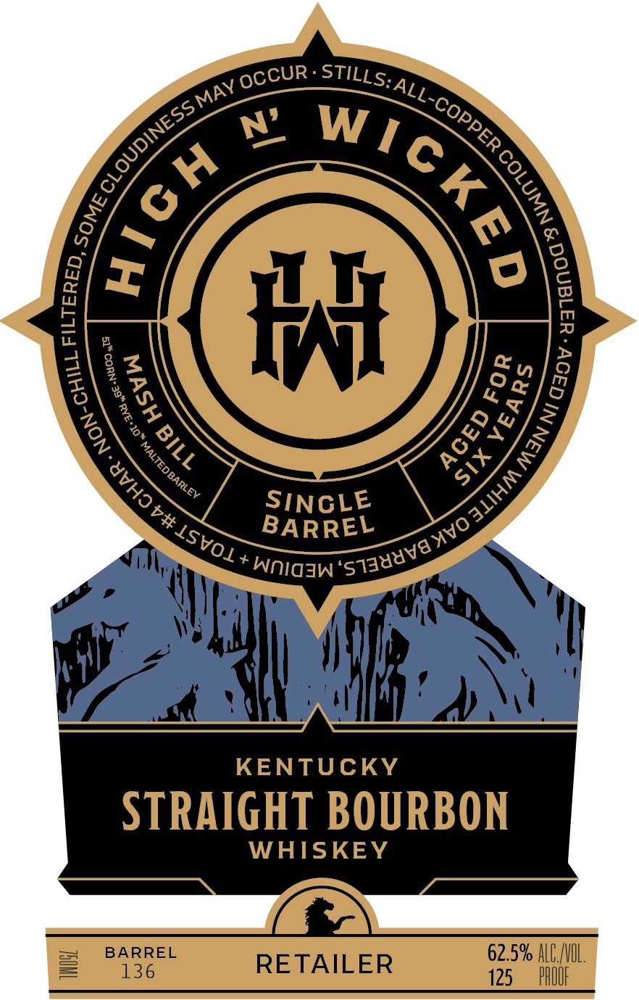
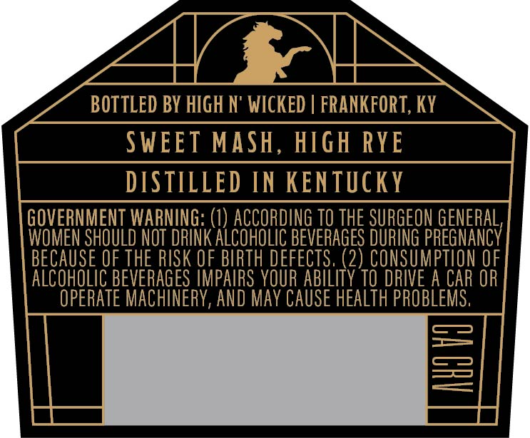
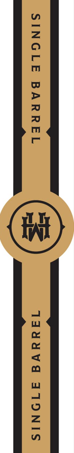

# TTB COLA Label Images - TTBID 25274001000084

**Brand Name:** HIGH N WICKED

**Fanciful Name:** SINGLE BARREL BOURBON

**Issue Date:** 01/02/2026

**Origin Code:** 22

**Product Class/Type:** 101

**Source:** [TTB Public COLA Registry](https://ttbonline.gov/colasonline/viewColaDetails.do?action=publicFormDisplay&ttbid=25274001000084)

## Label Images

### Label 1

### Label 2

### Label 3

## Extracted Label Text

*Text extracted via OCR - may contain errors*

*1 image(s) excluded: text did not meet readability threshold*

### Label 2

BOTTLED BY HIGH N' WICKED | FRANKFORT, KY ;
SWEET MASH, HIGH RYE
DISTILLED IN KENTUCKY

GOVERNMENT WARNING: (1) ACCORDING T0 THE SURGEON GENERAL,
WOMEN SHOULD NOT DRINK ALCOHOLIC BEVERAGES DURING PREGNANCY
BECAUSE OF THE RISK OF BIRTH DEFECTS, (2) CONSUMPTION OF
ALCOHOLIC BEVERAGES IMPAIRS YOUR ABILITY TO DRIVE A CAR OR
OPERATE MACHINERY, AND MAY CAUSE HEALTH PROBLEMS,
=
ca
—
—
LI a

### Label 3

— SST a
SINGLE BARREL 1duuvd ATONIS

eee \" / see
