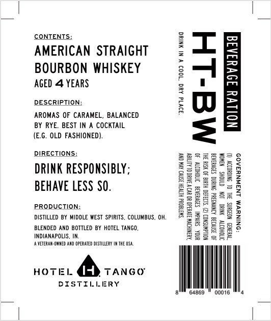
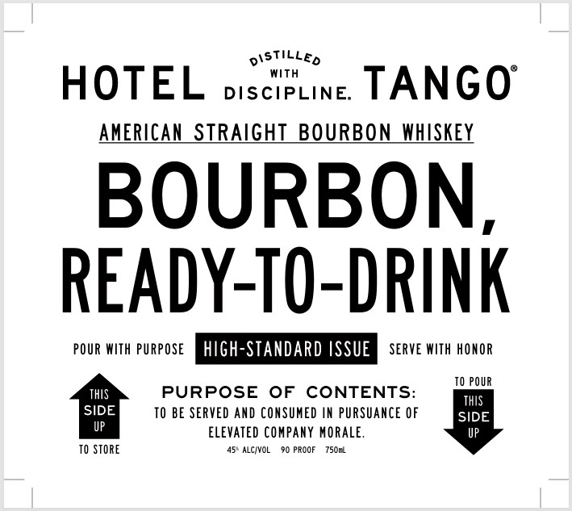

# TTB COLA Label Images - TTBID 25313001000036

**Brand Name:** HOTEL TANGO

**Issue Date:** 11/21/2025

**Origin Code:** 09

**Product Class/Type:** 101

**Source:** [TTB Public COLA Registry](https://ttbonline.gov/colasonline/viewColaDetails.do?action=publicFormDisplay&ttbid=25313001000036)

## Label Images

### Back Label

### Front Label

## Extracted Label Text

*Text extracted via OCR - may contain errors*

**Detected Proof:** 90
**Detected Age:** 4 Years

### Back Label

CONTENTS:

AMERICAN STRAIGHT

BOURBON WHISKEY
AGED 4 YEARS

DESCRIPTION:

AROMAS OF CARAMEL, BALANCED
BY RYE. BEST IN A COCKTAIL
(E.G. OLD FASHIONED).

30V1d AUG “1009 ¥ NI HNING

DIRECTIONS:

DRINK RESPONSIBLY;
BEHAVE LESS SO.

PRODUCTION:
DISTILLED BY MIDDLE WEST SPIRITS, COLUMBUS, OH.

BLENDED AND BOTTLED BY HOTEL TANGO,
INDIANAPOUIS, IN.
-ANETERAROWWED AND OPRATEDOSTLERY THE US,

1044 HVGR 3S AYN OY

‘ONINUWM LN3WNU3A09

HOTE

is

### Front Label

DistiLLed
With
HOTEL
DISCIPLINE
TANGO
AMERICAN_STRAIGHT_BOURBON_WHLSKEY
BOURBON
READY-TO-DRINK
POUR WIth PURPOSE
hIgh-STANDARD ISSUE
SERVE WITh HONOR
TO POUR
ThIS
PURPOSE
OF
CONTENTS:
ThIS
SIDE
TO BE SERVED AND CONSUMED IN PURSUANCE OF
SIDE
elevated Company MORALE_
TO STORE
ALCIWOL
90 PROOF
750n2
