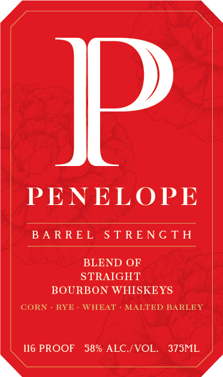
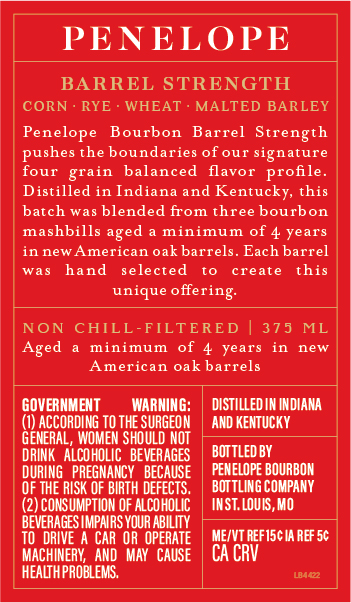

# TTB COLA Label Images - TTBID 25317001000094

**Brand Name:** PENELOPE

**Fanciful Name:** BARREL STRENGTH

**Issue Date:** 12/04/2025

**Origin Code:** 44

**Product Class/Type:** 121

**Source:** [TTB Public COLA Registry](https://ttbonline.gov/colasonline/viewColaDetails.do?action=publicFormDisplay&ttbid=25317001000094)

## Label Images

### Label 1

### Label 2

### Label 3

## Extracted Label Text

*Text extracted via OCR - may contain errors*

*1 image(s) excluded: text did not meet readability threshold*

**Detected Proof:** 116
**Detected Age:** 4 Years

### Label 1

P
PENELOPE
B A R REL
S T RENG TH
BLEND OF
STRAIGHT
BOURBON WHISKEYS
CORN
RYE
WHEAT
MALTED BARLEY
116 PROOF
58% ALC /VOL.
375ML

### Label 2

PENELOPE
BARREL STRENGTH
CORN
RYE
WHEAT
MALTED BARLEY
Penelope
Bourbon
Barrel
Strength
pushes the boundaries of our signature
four grain
balanced
flavor profile
Distilled in Indiana and Kentucky, this
batch was blended from three bourbon
mashbills aged
minimum
of 4 years
in new American oak barrels
Each barrel
was
hand
selected
create
this
unique offering
NON
CHILL-FILTERED | 375
ML
Aged
minimum
of 4
years
new
American oak barrels
GOVERMMENT
WARNING:
DISTILLED IN INDIANA
ACCORDING TO thE SURGEON
AND KENTUCKY
GENERAL, WOMEN SHOULD NOT
DRINK   alcohoLIC   beveRAGES
BOTTLED BY
DURING   PREGMANCY   beCAUSE
PENELOPE BOURBON
OF THE RISK OF BIRTH DEFECTS.
BOT TLING COMPANY
(2) CONSUMPTION OF alcoholic
INST LOUIS, MO
BEVERAGES IMPAIRS YOUR ABILITY
TO   DRIVE A CAR OR OPERATE
MEIVT REFISC IA REF 5c
MACHINERY;   AND  MAY   CAUSE
CA CRV
HEALTHPROBLEMS.
T
