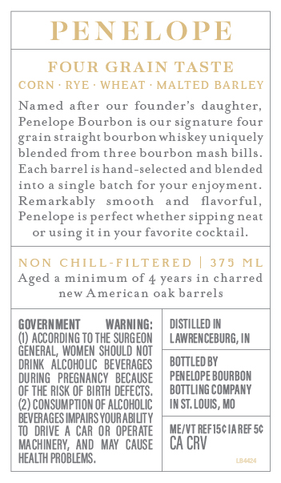
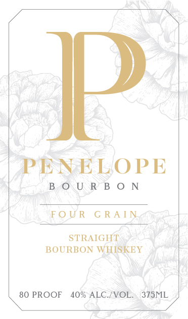
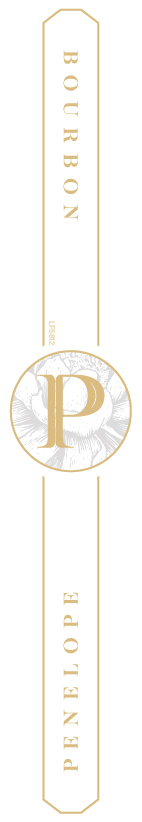

# TTB COLA Label Images - TTBID 25317001000100

**Brand Name:** PENELOPE

**Fanciful Name:** FOUR GRAIN

**Issue Date:** 12/01/2025

**Origin Code:** 44

**Product Class/Type:** 101

**Source:** [TTB Public COLA Registry](https://ttbonline.gov/colasonline/viewColaDetails.do?action=publicFormDisplay&ttbid=25317001000100)

## Label Images

### Back Label

### Front Label

### Label 3

## Extracted Label Text

*Text extracted via OCR - may contain errors*

*2 image(s) excluded: text did not meet readability threshold*

**Detected Age:** 4 Years

### Back Label

PENELOPE
FOUR GRAIN TASTE
CORN
RYE
WHEAT
MALTED BARLEY
Named after
our founder's daughter;
Penelope Bourbon is our Signature four
grain straight bourbon whiskeyuniquely
blended from three bourbon mash bills
Each barrel is hand-selected and blended
into
single batch for your enjoyment_
Remarkably
smooth
and
flavorful,
Penelope is perfect whether sipping neat
using it in Your favorite cocktail
NON
CHILL-FILTE RED
375
ML
Aged
minimum of 4 years in charred
new American oak barrels
GOVERMMENT
WARNING:
DISTILLED IN
ACCORDING TO THE SURGEON
LAWRENCEBURG; IN
GENERAL, WOMEN  SHOULD NOT
DRINK   AlCohOLC  BEVERAGES
BOTTLED BY
DURING   PREGMANCY   BECAUSE
PENELOPE BOURBON
OF THE RISK OF BIRTH DEFECTS ,
BOTTLING COMPANY
CONSUMPTION OF AlCOHOLIC
IN ST. LOUIS , MO
BEVERAGES IMPAIRS VOURABITY
T0   DRIVE
CAR OR OPERATE
ME/VT REFISC IA REF 5c
MA CHINERV,  And   MaY   CAUSE
CA CRV
HEALTH PROBLEMS
U 424
