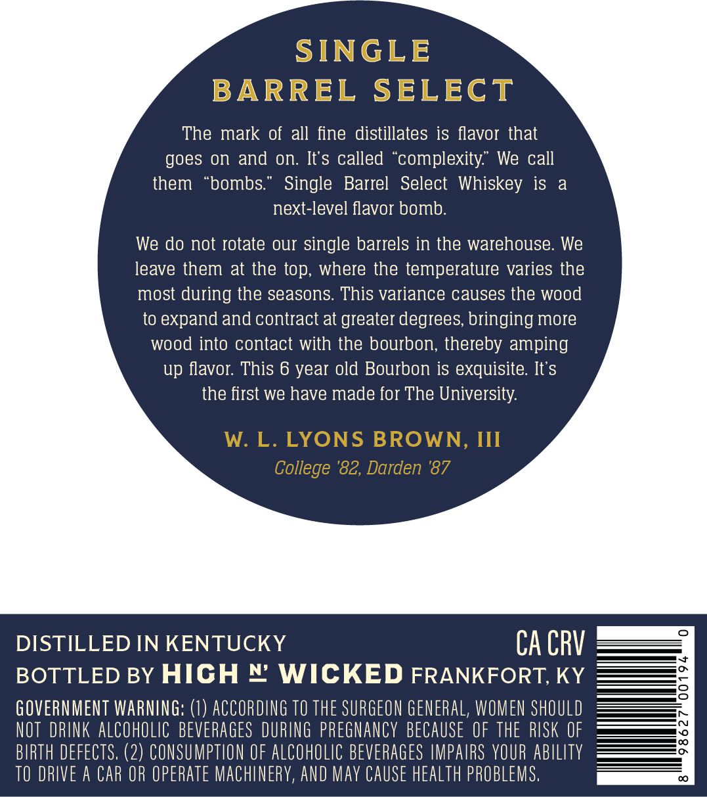
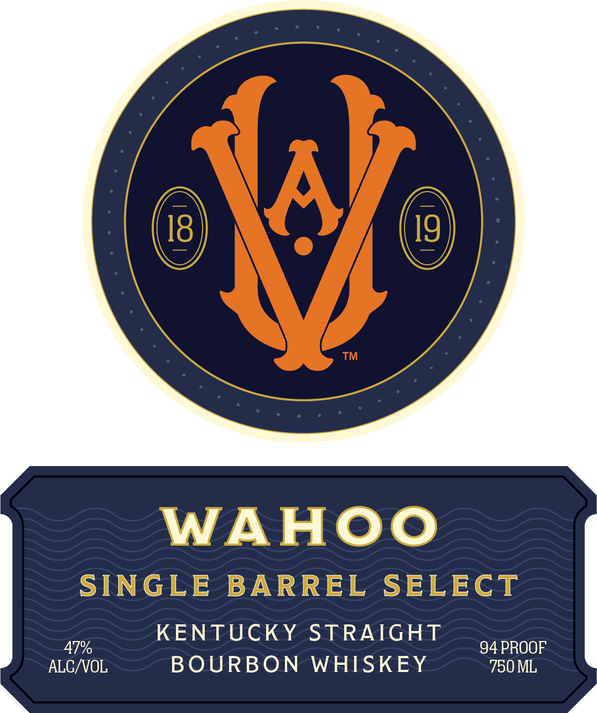

# TTB COLA Label Images - TTBID 25323001000647

**Brand Name:** WAHOO

**Fanciful Name:** SINGLE BARREL SELECT

**Issue Date:** 01/12/2026

**Origin Code:** 22

**Product Class/Type:** 101

**Source:** [TTB Public COLA Registry](https://ttbonline.gov/colasonline/viewColaDetails.do?action=publicFormDisplay&ttbid=25323001000647)

## Label Images

### Back Label

### Front Label

### Label 3

## Extracted Label Text

*Text extracted via OCR - may contain errors*

*1 image(s) excluded: text did not meet readability threshold*

### Back Label

SINGLE

BARREL SELECT

The mark of all fine distillates is flavor that

goes on and on. It's called “complexity.” We call

them “bombs.” Single Barrel Select Whiskey is a

next-level flavor bomb.

We do not rotate our single barrels in the warehouse. We

leave them at the top, where the temperature varies the

most during the seasons. This variance causes the wood

to expand and contract at greater degrees, bringing more

wood into contact with the bourbon, thereby amping

up flavor. This 6 year old Bourbon is exquisite. It’s

the first we have made for The University.

DISTILLED IN KENTUCKY

CACRV

BOTTLED BY HIGH © WICKED FRANKFORT, KY

GOVERNMENT WARNING: (1) ACCORDING TO THE SURGEON GENERAL, WOMEN SHOULD

NOT DRINK ALCOHOLIC BEVERAGES DURING PREGNANCY BECAUSE OF THE RISK OF

BIRTH DEFECTS, (2) CONSUMPTION OF ALCOHOLIC BEVERAGES IMPAIRS YOUR ABILITY

TO DRIVE A CAR OR OPERATE MACHINERY, AND MAY CAUSE HEALTH PROBLEMS.

### Front Label

WAHOO

SINGLE BARREL SELECT

0,

KENTUCKY STRAIGHT

4 PROOF

ALC OL

BOURBON WHISKEY

750 ML
