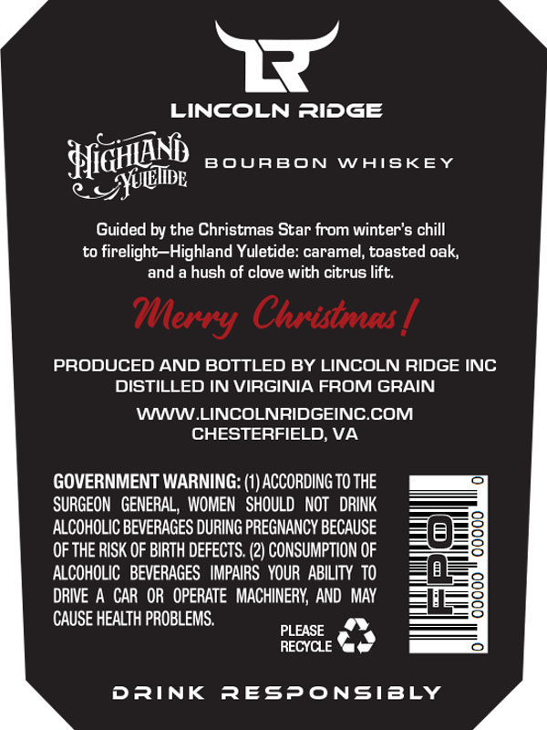
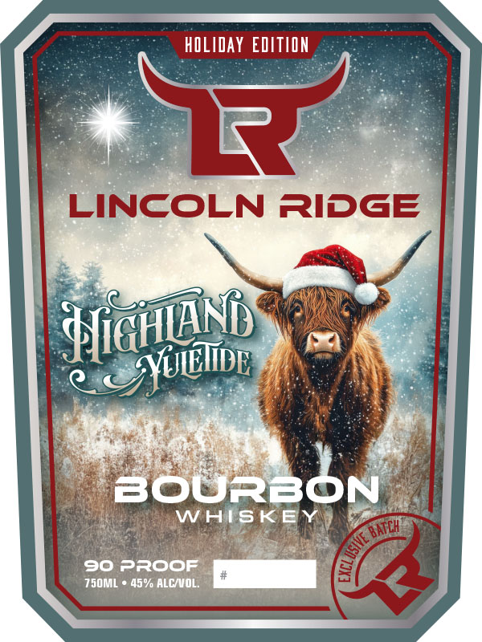

# TTB COLA Label Images - TTBID 25325001000151

**Brand Name:** LINCOLN RIDGE

**Fanciful Name:** HIGHLAND YULETIDE

**Issue Date:** 11/28/2025

**Origin Code:** 05

**Product Class/Type:** 141

**Source:** [TTB Public COLA Registry](https://ttbonline.gov/colasonline/viewColaDetails.do?action=publicFormDisplay&ttbid=25325001000151)

## Label Images

### Back Label

### Front Label

## Extracted Label Text

*Text extracted via OCR - may contain errors*

**Detected Proof:** 90

### Back Label

LINCOLN RIDGE
HiGHunm
BOUABON
WAISKEY
Guided by the Christmas Star from winter's chill
to firelight-Highland Yuletide: caramel; toasted oak;
and a hush of clove with citrus lift.
Christmas
PRODUCED AND BOTTLED BY LINCOLN RIDGE INC
DISTILLED IN VIRGINIA FROM GRAIN
WWW LINCOLNRIDGEINC.COM
CHESTERFIELD; VA
GOVERNMENT WARNING: (1) ACCORDING TO THE
SURGEON   GENERAL, WOMEN   SHOULD  NOT   DRINK
ALCOHOLIC BEVERAGES DURING PREGNANCY BECAUSE
8
OF THE RISK OF BIRTH DEFECTS.
2) CONSUMPTION OF
ALCOHOLIC   BEVERAGES   IMPAIRS   YOUR  ABILITY  TO
8
DRIVE A CAR OR   OPERATE   MACHINERY; AND MAY
8
CAUSE HEALTH PROBLEMS.
PLEASE
RECYCLE
DRINK
Responsibly
~YUliDE
MMerry

### Front Label

hdLIday EDITION
LINCOLN RIDGE
Hiann
BOURBON
WAISKE
90 PROOF
750mL
45% AlcNOL;
8 & YUEIiB
LBATcH
