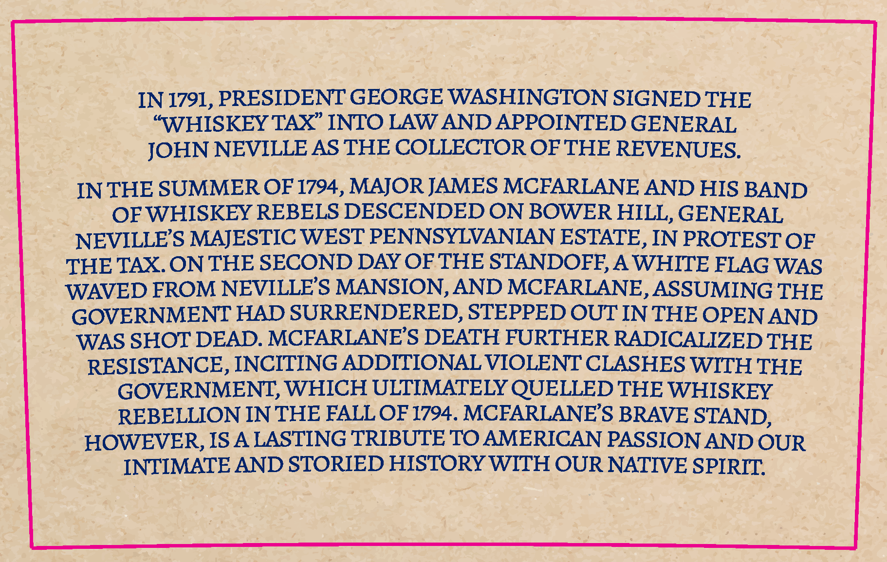
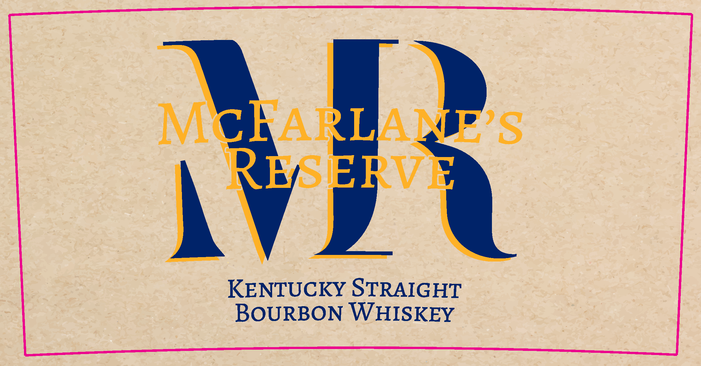
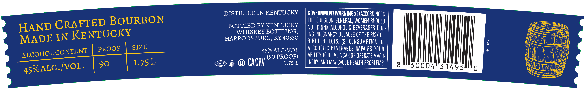

# TTB COLA Label Images - TTBID 25329001000666

**Brand Name:** MCFARLANE'S RESERVE

**Issue Date:** 12/03/2025

**Origin Code:** 22

**Product Class/Type:** 101

**Source:** [TTB Public COLA Registry](https://ttbonline.gov/colasonline/viewColaDetails.do?action=publicFormDisplay&ttbid=25329001000666)

## Label Images

### Back Label

### Front Label

### Label 2

## Extracted Label Text

*Text extracted via OCR - may contain errors*

**Detected Proof:** 90

### Back Label

IN 1791, PRESIDENT GEORGE WASHINGTON SIGNED THE
"WHISKEY TAX" INTO LAW AND APPOINTED GENERAL
JOHN NEVILLE AS THE COLLECTOR OF THE REVENUES.
IN THE SUMMER OF 1794, MAJOR JAMES MCFARLANE AND HIS BAND
OFWHISKEY REBELS DESCENDED ON BOWER HILL, GENERAL
NEVILLES MAJESTIC WEST PENNSYLVANIAN ESTATE , IN PROTEST OF
THE TAX  ON THE SECOND DAY OF THE STANDOFE,
AWHITE FLAG WAS
WAVED FROM NEVILLE'S MANSION,AND MCFARLANE,ASSUMING THE
GOVERNMENT HAD SURRENDERED, STEPPED OUT INTHE OPEN AND
WAS SHOT DEAD. MCFARLANES DEATH FURTHER RADICALIZED THE
RESISTANCE, INCITING ADDITIONAL VIOLENT CLASHES WITH THE
GOVERNMENT; WHICH ULTIMATELY QUELLED THE WHISKEY
REBELLION IN THE FALL OF 1794. MCFARLANES BRAVE STAND,
HOWEVER, ISA LASTING TRIBUTE TO AMERICAN PASSION AND OUR
INTIMATE AND STORIED HISTORY WITH OUR NATIVE SPIRIT:

### Front Label

McHARLANP $
RBERVE
KENTUCKY STRAIGHT
BOURBON WHISREY

### Label 2

DISTILLED IN KENTUCKY
GOVERNMENTWARNING:(0JACCORDING TO
CRAFTED BOURBON
THE SURGEON GENERAL, WOMEN SHOULD
HAND
BOTTLED BY KENTUCKY
NOT DRINK ALCOHOLIC BEVERAGES DUR:
IN KENTUCKY
WHISKEY BOTTLING ,
ING PREGNANCY BECAUSE OF THE RISK OF
MADE
HARRODSBURG, KY 40330
BIRTH DEFECTS . (29  CONSUMPTION OF
CONTENT_
PROOF
SIZE
45% ALCIVOL
ALcOhOLIC BEVERAGES IMPAIRS YOUR
1
ALCOHOL_
90 PROOF)
ABILITY TO DRIVE A CAR OR OPERATE MACH:
CACRV
1.75 L
INERV; AND May CAUSE health PROBLEMS
8
45hALC IvoL:
600041314954
0
1.75L
