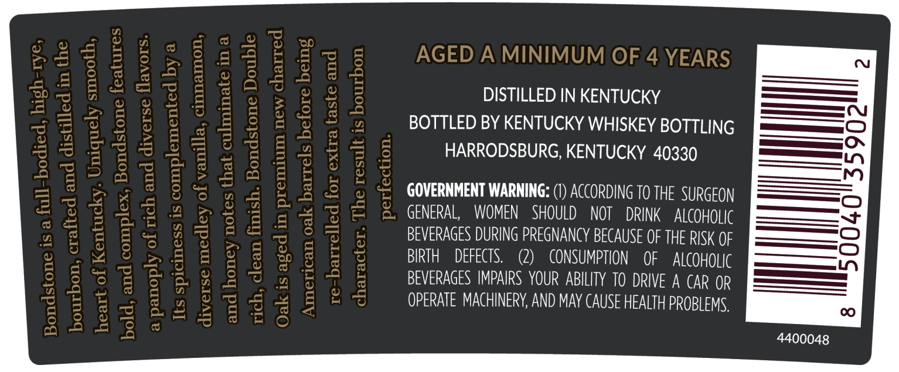
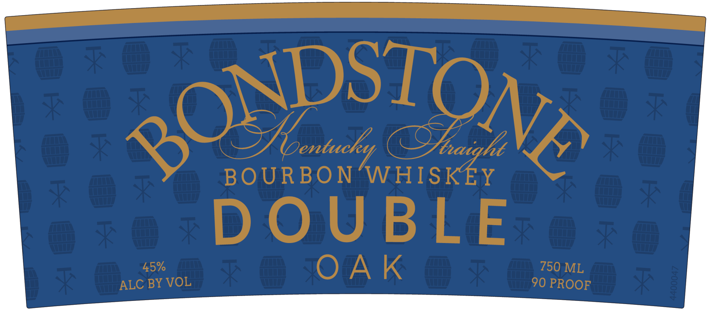

# TTB COLA Label Images - TTBID 25329001000679

**Brand Name:** BONDSTONE

**Fanciful Name:** DOUBLE OAK

**Issue Date:** 12/03/2025

**Origin Code:** 22

**Product Class/Type:** 101

**Source:** [TTB Public COLA Registry](https://ttbonline.gov/colasonline/viewColaDetails.do?action=publicFormDisplay&ttbid=25329001000679)

## Label Images

### Back Label

### Front Label

### Label 3

## Extracted Label Text

*Text extracted via OCR - may contain errors*

*1 image(s) excluded: text did not meet readability threshold*

**Detected Proof:** 90
**Detected Age:** 4 Years

### Back Label

stilled in the

juely mooth,

before being

elled for ext

ae)
i}
ze)
v
a
nD
v
x

character.

perfection.

AGED A MINIMUM OF 4 YEARS

DISTILLED IN KENTUCKY
BOTTLED BY KENTUCKY WHISKEY BOTTLING
HARRODSBURG, KENTUCKY 40330

GOVERNMENT WARNING: (1) ACCORDING TO THE SURGEON
GENERAL, WOMEN SHOULD NOT DRINK ALCOHOLIC
BEVERAGES DURING PREGNANCY BECAUSE OF THE RISK OF
BIRTH DEFECTS. (2) CONSUMPTION OF ALCOHOLIC
BEVERAGES IMPAIRS YOUR ABILITY TO DRIVE A CAR OR
OPERATE MACHINERY, AND MAY CAUSE HEALTH PROBLEMS,

4400048

### Front Label

QONDSTONA
Ioentucky
SJhaight
BOURBON 'WHISKEY
DOU BLE
45%
OA K
750 ML
ALC BY VOL
90 PROOF
3
