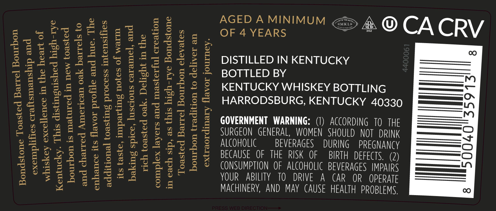
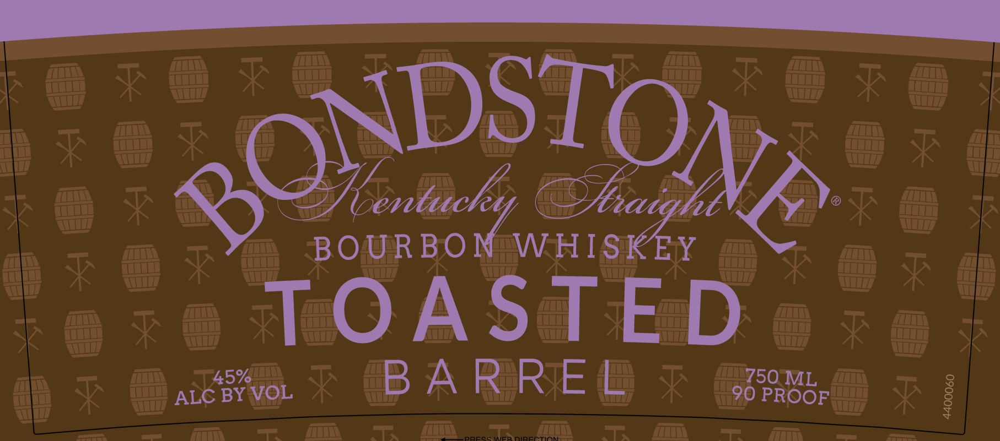

# TTB COLA Label Images - TTBID 25329001000696

**Brand Name:** BONDSTONE

**Fanciful Name:** TOASTED

**Issue Date:** 12/03/2025

**Origin Code:** 22

**Product Class/Type:** 101

**Source:** [TTB Public COLA Registry](https://ttbonline.gov/colasonline/viewColaDetails.do?action=publicFormDisplay&ttbid=25329001000696)

## Label Images

### Back Label

### Front Label

### Label 3

## Extracted Label Text

*Text extracted via OCR - may contain errors*

*1 image(s) excluded: text did not meet readability threshold*

**Detected Proof:** 90

### Back Label

ae gy AGED A MINIMUM <>
<2 bestlsz, ibs, oraveans ” @*OCACRV
Beceeesa ese seete
- = 203 = 2 3 a
Ba eee e525 22584 2 £ DISTILLED IN KENTUCKY ————
sag2248 26555 223 Bormepsy =n
g2228 222228 24,5 £ & KENTUCKY WHISKEY BOTTLING =—s.
2g 5E 2 5527S 2553 55 HARRODSBURG, KENTUCKY 40330 [E=—A
Segessaen sess gsaupss —_™
25252885 255 FS = ES GOVERNMENT WARNING (1) COLT OE —
E2225 lS 2 EF SF 42°F SURGEON GENERAL WOMEN SHOULD NOT ORK —on
ge CR Sees eF2E Sz ES MCOWOLIC BEVERAGES DURING REY —
SES SESE z wes 2S SS BECAUSE OF THE RIK OF BROS? —_—
S222 ES £2522 ES SS © CONSUMPTION oF ALCOHOLIC BEVERAGES MPARS ——
po ea eecte gee YOUR ABILITY TO DRIVE A CAR OR OPERME ——
2° 858 Se MACHINERY, AND MAY CAUSE HEALTH PROBLEMS. 00

### Front Label

SONDSTONA
BOUR BONAWHISKEY
TOASTED
45%
B A RRZE B
750 ML
ALC BY VOL
90 PROOF
2
1
