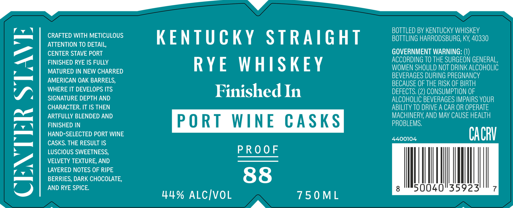
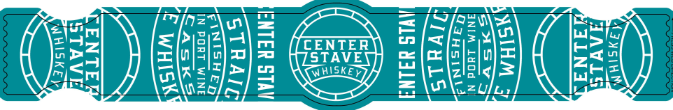

# TTB COLA Label Images - TTBID 25329001000719

**Brand Name:** CENTER STAVE

**Issue Date:** 12/03/2025

**Origin Code:** 22

**Product Class/Type:** 102

**Source:** [TTB Public COLA Registry](https://ttbonline.gov/colasonline/viewColaDetails.do?action=publicFormDisplay&ttbid=25329001000719)

## Label Images

### Front Label

### Label 2

### Label 3

## Extracted Label Text

*Text extracted via OCR - may contain errors*

**Detected Proof:** 88

### Front Label

BOTTLED BY KENTUCKY WHISKEY
CRAFTED WITH METICULOUS
KENTUCKY
STRAIGHT
BOTTLING HARRODSBURG, KY, 40330
ATTENTION TO DETAIL,
CENTER STAVE PORT
GOVERNMENT WARNING:
FINISHED RYE IS FULLY
RYE
W HISKEY
ACCORdiNG TO THE SURGEON GENERAL,
WOMEN SHOULD NOT DRINK ALCOHOLIC
MATURED IN NEW CHARRED
BEVERAGES DURING PREGNANCY
AMERICAN OAK BARRELS;
BECAUSE OF THE RISK OF BIRTH
WHERE IT DEVELOPS ITS
Finished In
DEFECTS: (2) CONSUMPTION OF
SIGNATURE DEPTH AND
ALCOHOLIC BEVERAGES IMPAIRS YOUR
CHARACTER. IT IS THEN
ABILITY TO DRIVE A CAR OR OPERATE
ARTFULLY BLENDED AND
MACHINERY AND MAy CAUSE HEALTH
FINISHED IN
PO RT
WINE
CAsks
PROBLEMS;
2
HAND-SELECTED PORT WINE
4400104
CACV
CASKS: THE RESULT IS
LUSCIOUS SWEETNESS,
PRooF
VELVETY TEXTURE, AND
LAYERED NOTES OF RIPE
BERRIES, DARK CHOCOLATE;
88
AND RYE SPICE
8
50040"35923'
44% ALCIvoL
75 0 ML

### Label 2

Y
FINISHED
IN
PORT
WINE
CASK5
Tk
_
k
1
5
GTRAIGHT
KY
WHISKEY+
XRYE

### Label 3

ANIM LUOd N

REREIDSS,

ENTER STAY
STRAIC
GINISHED
ae
SAasKk3.
£ Wisk

PX

rENTE
STAVE
NUHISK Ey

ST
