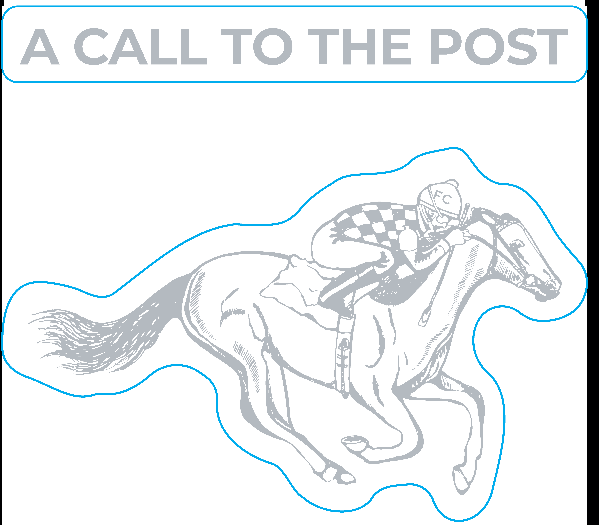

# TTB COLA Label Images - TTBID 25329001000738

**Brand Name:** FIRST CALL

**Issue Date:** 12/03/2025

**Origin Code:** 22

**Product Class/Type:** 101

**Source:** [TTB Public COLA Registry](https://ttbonline.gov/colasonline/viewColaDetails.do?action=publicFormDisplay&ttbid=25329001000738)

## Label Images

### Back Label

### Front Label

### Label 3

## Extracted Label Text

*Text extracted via OCR - may contain errors*

*1 image(s) excluded: text did not meet readability threshold*

**Detected Proof:** 90

### Back Label

First Call Kentucky Straight
Bourbon Whiskey was crafted
in homage to America's original
sport, thoroughbred racing,
and Kentucky's Iconic role in its
development. As far back as
the early eighteenth century,
before the introduction of
thoroughbreds to North America,

the bugler inspired spectators
and racers with "the first call"

or "the call to the post," signaling
that "it's off to the races."

GOVERNMENT WARNING: (1) ACCORDING TO
THE SURGEON GENERAL, WOMEN SHOULD
NOT DRINK ALCOHOLIC BEVERAGES DURING
PREGNANCY BECAUSE OF THE RISK OF BIRTH
DEFECTS. 4 CONSUMPTION OF ALCOHOLIC
BEVERAGES IMPAIRS YOUR ABILITY TO DRIVE
A CAR OR OPERATE MACHINERY, AND MAY
CAUSE HEALTH PROBLEMS.

AGED OVER FOUR YEARS

DISTILLED IN KENTUCKY

BOTTLED BY KENTUCKY WHISKEY
BOTTLING, HARRODSBURG, KY 40330

=>

90040°55906°"0

Oo
OO
SE

### Front Label

FIRST
CALL
KENTUCKY
STRAIGHT
BOURBON
WHISKEY
6
45% ALCIvoL
90 PROOF
750 ML
