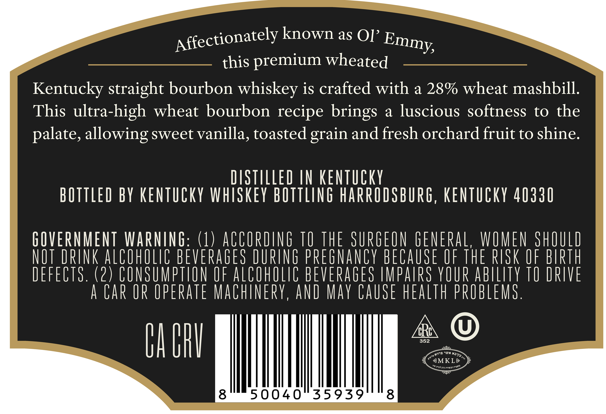
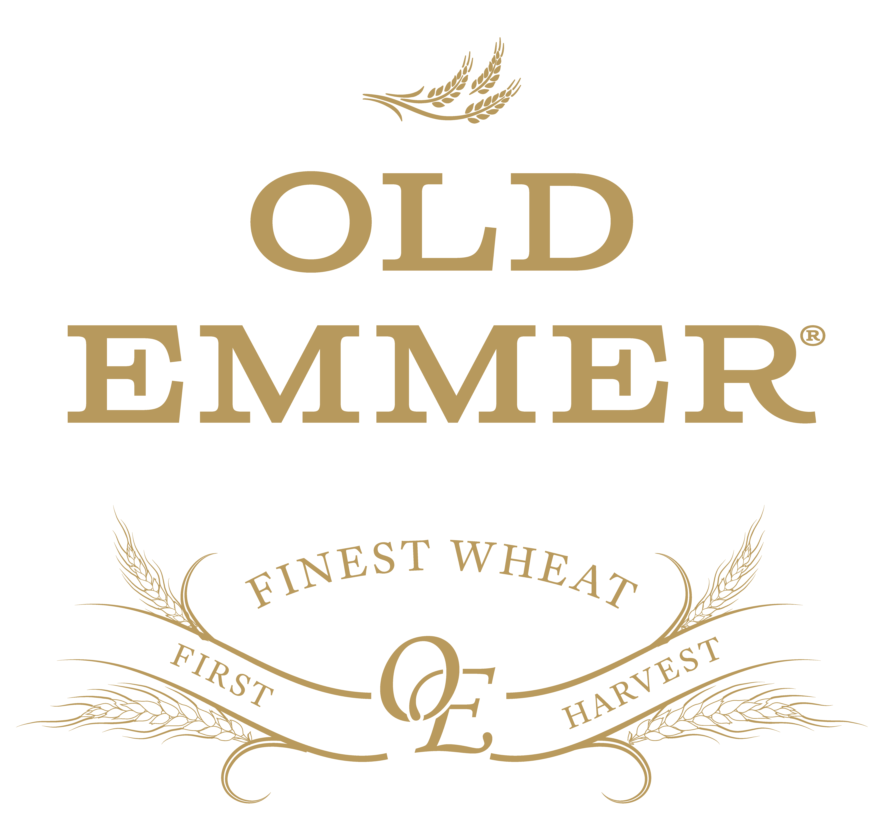

# TTB COLA Label Images - TTBID 25329001000759

**Brand Name:** OLD EMMER

**Fanciful Name:** HIGH WHEAT

**Issue Date:** 12/03/2025

**Origin Code:** 22

**Product Class/Type:** 101

**Source:** [TTB Public COLA Registry](https://ttbonline.gov/colasonline/viewColaDetails.do?action=publicFormDisplay&ttbid=25329001000759)

## Label Images

### Back Label

### Front Label

### Label 2

## Extracted Label Text

*Text extracted via OCR - may contain errors*

### Back Label

affectionately known as OJ’ Emmy

this premium wheated

Kentucky straight bourbon whiskey is crafted with a 28% wheat mashbill.

This ultra-high wheat bourbon recipe brings a luscious softness to the

palate, allowing sweet vanilla, toasted grain and fresh orchard fruit to shine.

DISTILLED IN KENTUCKY

BOTTLED BY KENTUCKY WHISKEY BOTTLING HARRODSBURG, KENTUCKY 40330

GOVERNMENT WARNING: (1) ACCORDING 10 THE SURGEON GENERAL, WOMEN SHOULD

NOT DRINK ALDUHULIC BEVERAGES DURING PREGNANCY BECAUSE UF The RIOK UF BIRTH

DEFECTS. (2) CONSUMPTION OF ALCOHOLIC BEVERAGES IMPAIRS YOUR ABILITY 10 DRIVE

A CAR UR UPERATE MACHINERY, AND MAY CAUSE HEALTH PROBLEMS.

A WY

bALIN

MKL

8

90040 35959

8

### Front Label

HIGH
WHEAT
J <f.f, a)
Heentaaky height €auabon Mask

### Label 2

OLD
EMMER
(
FINEST
WHEAT
HARVEST
FIRST
