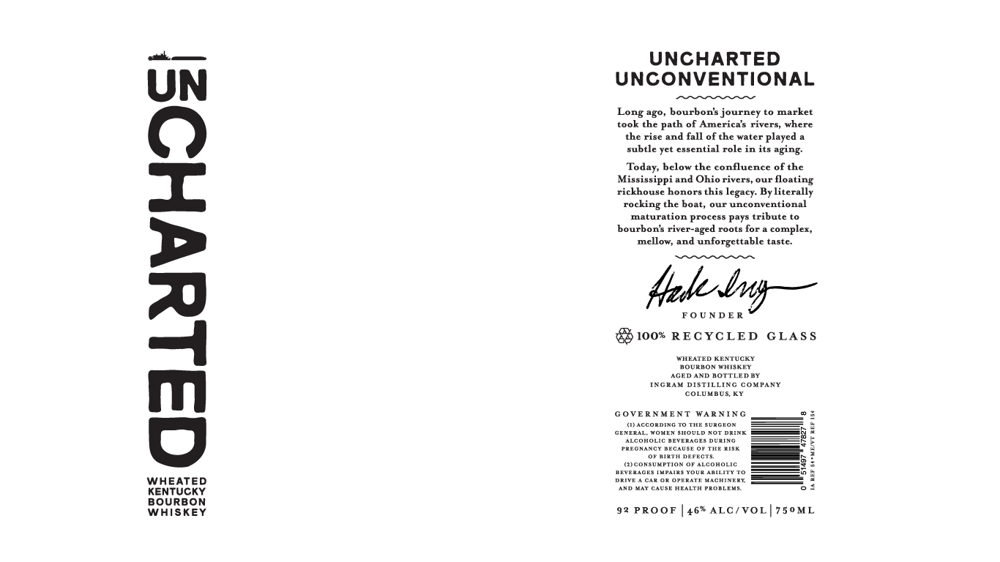

# TTB COLA Label Images - TTBID 25336001000556

**Brand Name:** UNCHARTED

**Issue Date:** 03/09/2026

**Origin Code:** 43

**Product Class/Type:** 141

**Source:** [TTB Public COLA Registry](https://ttbonline.gov/colasonline/viewColaDetails.do?action=publicFormDisplay&ttbid=25336001000556)

## Label Images

### Label 1

## Extracted Label Text

*Text extracted via OCR - may contain errors*

### Label 1

UNCHARTED
UNCONVENTIONAL

45O4 bourbonh journey t0 market
took te
cf Americrh riverd Yhere
the rine and fll ofthe Iater played 4
hubte
euential role in it aging
belor tha condluence oftha
Misianippi und Ohiorivert, our floating
rickhousa honors thip
Bylitarally
rocking the bont, our unconventional
mntuzntion procenn pan tribute t0
bourbont Fivera
Tonti fr
compler
mellov; and unforgettable tinte:
I
{1002 REOXOLED
GLA8 8
ATHTATEITA
rootontANte
AGED
BOTTLEDHT

DIATILLIKG doHrAny
DOLTIATR EI
GOVBRNHENT
MARNING
TIA#thi
HHE AHEEDT
CFAEAAEIEH
Sn
FLADELLAAA#AAGEE OAIAO
SATAaaa
2
OT CIRTA Drtati
HIdOHAMETiD4i
AAAHAH
AAREATnAH
WHEATED
Hl
HAHDALEAAATEHAAHH
1
3
RENTUCKY
BoURBON
WhiSkeY
92 FBOOF
162 ALCIVOL
760KI
Long
Path
t
Todar
lagact
red
