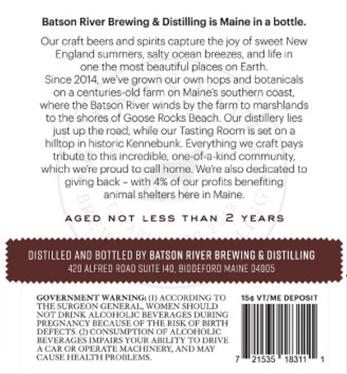
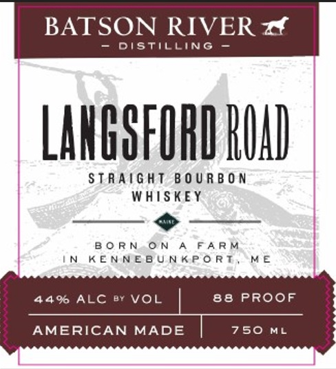

# TTB COLA Label Images - TTBID 25337001000064

**Brand Name:** BATSON RIVER

**Fanciful Name:** LANGSFORD ROAD

**Issue Date:** 12/05/2025

**Origin Code:** 33

**Product Class/Type:** 101

**Source:** [TTB Public COLA Registry](https://ttbonline.gov/colasonline/viewColaDetails.do?action=publicFormDisplay&ttbid=25337001000064)

## Label Images

### Back Label

### Front Label

## Extracted Label Text

*Text extracted via OCR - may contain errors*

**Detected Proof:** 88

### Back Label

Batson River Brewing & Distilling is Maine in a bottle.
Our craft beers and spirits capture the jol of sweet New
Ergland 5ummers, salty ocean breezes, and life in
one the most beautiful places on Earth
Since 2014,wieve grown our ovin hops
botanical5
onacenturies-old farm on Maines southern coast;
where the Batscn River ivinds by the farm t0 marshland:
the shores of Goose Recks Deacn Our disullery lies
Just up the road, while our Tasting Room IS sOt on
hiiltop in historic Kennebunk Everything vig craft pays
tribute t0 this ircredible, one of-a kind cominunity
wtiich wete proud tc call rierrie: Wete also dediculed (0
givng back
witt 4% of cur prolits Eneliting
animal shallers here in Naine;
AGED
Not
LESS
THAN
YEARS
OISTILLEO AND BOTTLEd BY BATSOK RIVER BREWING & DISTILLING
420 ALFRED RJAD Suite 140, BIDEFORO MAIME 14005
GOVERAMEXT" WARNINGHAIJACCORDIAG TO
184 Vt(ME Ulposit
THESCRCEON GENERAL WCMEN SHOULD
XOT DRINK ALCOHIOLIC BEVERAGES DURING
FREGNANCI BEC
USE OF THIE RISE Ol MRTT
DEFECTS HCONSUMPTION OF ALCOlIOLC
HLVERAGESMMPAIKS YUUK ALILIT { TUDKITE
CAROK OFLRATL MCIINERIAADMY
CAUSTLN PROMLENS
21515
1031
and

### Front Label

LANGOFORD ROAD

STRAIGHT BOURBON

WHISKEY

>

BORN.ON A FARM

IN KENNEBUNKPORT

ME

44% ALC

VOL

88 PROOF

AMERICAN MADE

750 Mt
