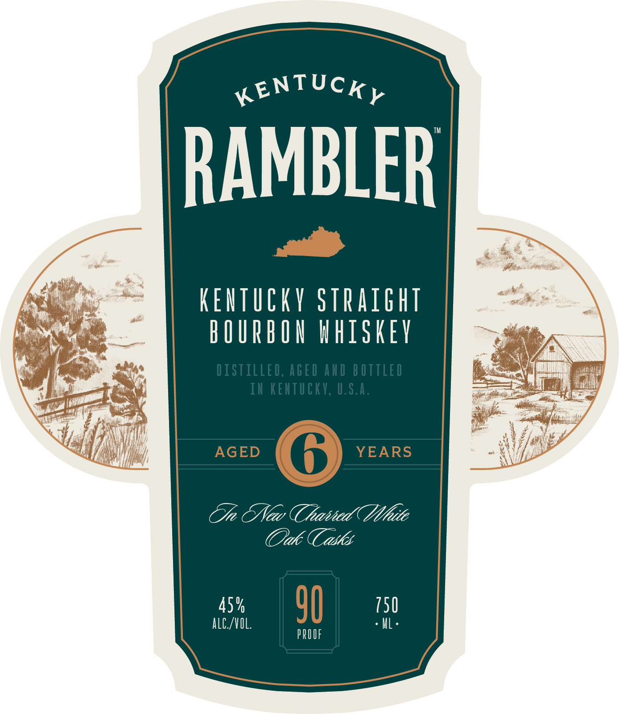

# TTB COLA Label Images - TTBID 25337001000442

**Brand Name:** KENTUCKY RAMBLER

**Issue Date:** 12/05/2025

**Origin Code:** 22

**Product Class/Type:** 101

**Source:** [TTB Public COLA Registry](https://ttbonline.gov/colasonline/viewColaDetails.do?action=publicFormDisplay&ttbid=25337001000442)

## Label Images

### Back Label

### Front Label

## Extracted Label Text

*Text extracted via OCR - may contain errors*

**Detected Proof:** 90
**Detected Age:** 6 Years

### Back Label

TAKE THE
PATH
LESS
W O RN
SMall
batch
m3

### Front Label

KENTUCKY
RAMBLER
KEiTuCKY straight
bOIRbOU #hiskev
DISTILLEd; AGEd AhD BOTTLed
IU KEHTUCKV, U.s.a.
AGED
6
YEARS
TJr &Neo TThaahhed
ite
Oak (Cadks
45 %
90
150
alC /VIL
ML _
PROUF
