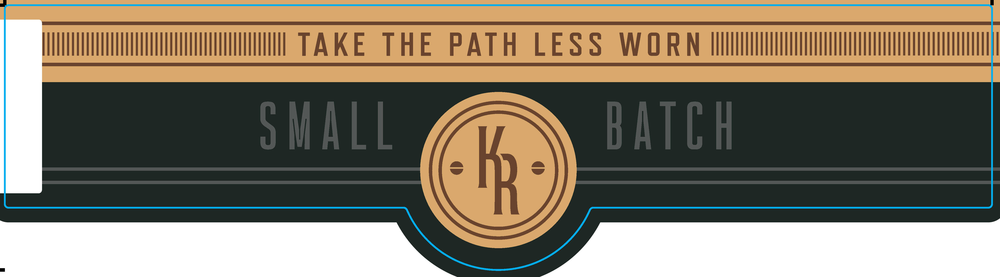
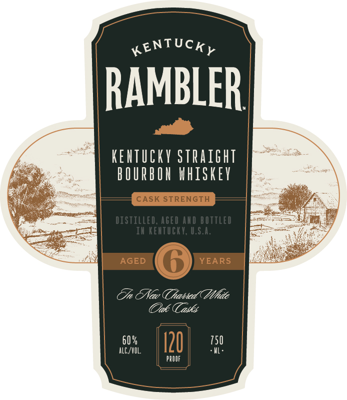

# TTB COLA Label Images - TTBID 25337001000464

**Brand Name:** KENTUCKY RAMBLER

**Fanciful Name:** CASK STRENGTH

**Issue Date:** 12/05/2025

**Origin Code:** 22

**Product Class/Type:** 101

**Source:** [TTB Public COLA Registry](https://ttbonline.gov/colasonline/viewColaDetails.do?action=publicFormDisplay&ttbid=25337001000464)

## Label Images

### Back Label

### Front Label

## Extracted Label Text

*Text extracted via OCR - may contain errors*

**Detected Proof:** 120

### Back Label

TAKE
THE
PATH
LESS
W O RN
S hall
batgh
mx

### Front Label

KENTUCKy
RAMBLER
KEUTCKY siraight
bOURbOX hhiskey
CASK STRENGTH
DISTILled, AGed AXD bottled
In Keitucky; U.S.4.
AGED
YEARS
Tn &Neav Thaatied ( Mhdte
Oak
asks
60 %
120
750
alC /VIL
pROOF
