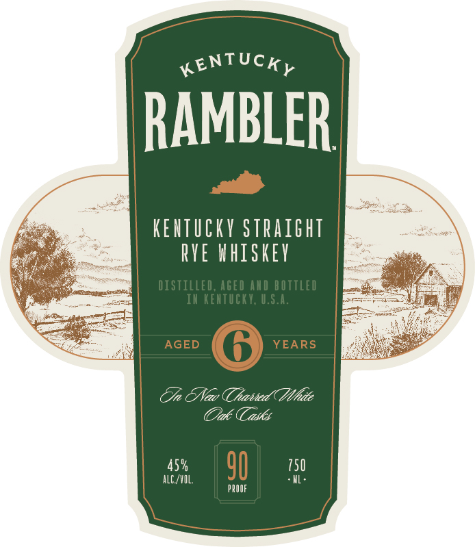

# TTB COLA Label Images - TTBID 25337001000489

**Brand Name:** KENTUCKY RAMBLER

**Issue Date:** 12/05/2025

**Origin Code:** 22

**Product Class/Type:** 102

**Source:** [TTB Public COLA Registry](https://ttbonline.gov/colasonline/viewColaDetails.do?action=publicFormDisplay&ttbid=25337001000489)

## Label Images

### Back Label

### Front Label

## Extracted Label Text

*Text extracted via OCR - may contain errors*

**Detected Proof:** 90

### Back Label

TAKE
THE
PATH
LESS
W ORN
S hall
batch

### Front Label

KENTUCKy
RAMBLER
KeaTUCKV straight
RYE whiskev
distilled; AGed Axd bottled
Ih Ketucky; U.S.A.
AGED
YEARS
TJn TNav (Tatied( Mhite
ak
"asks
45 %
90
750
alC /VIL
pQOOF
