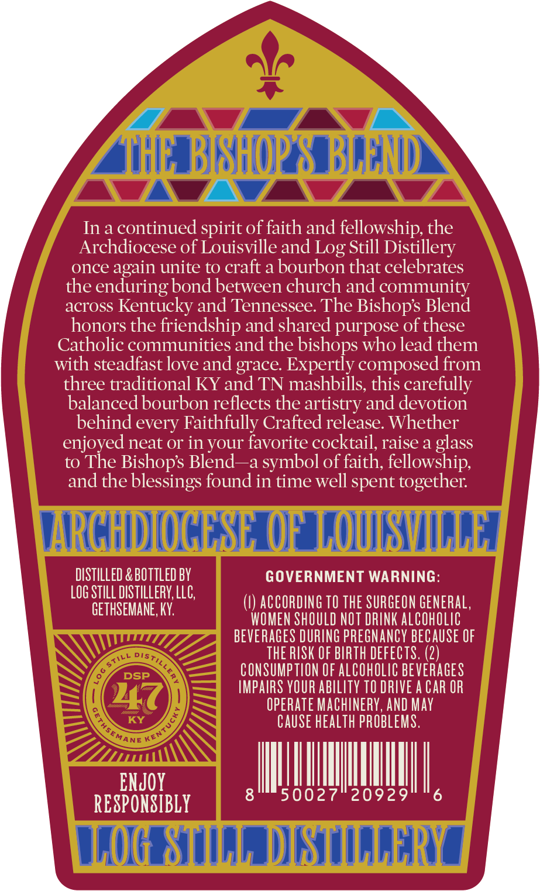
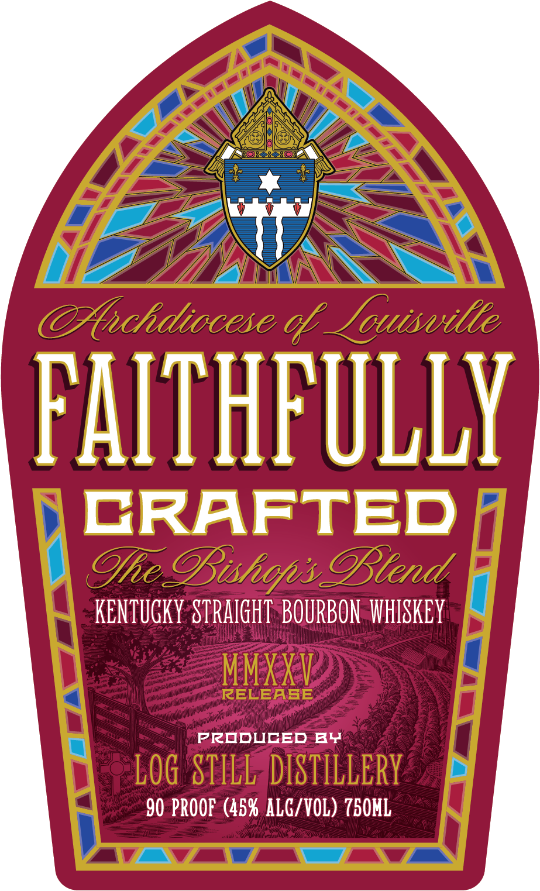

# TTB COLA Label Images - TTBID 25338001000636

**Brand Name:** FAITHFULLY CRAFTED

**Issue Date:** 12/09/2025

**Origin Code:** 22

**Product Class/Type:** 121

**Source:** [TTB Public COLA Registry](https://ttbonline.gov/colasonline/viewColaDetails.do?action=publicFormDisplay&ttbid=25338001000636)

## Label Images

### Back Label

### Front Label

### Label 3

## Extracted Label Text

*Text extracted via OCR - may contain errors*

*1 image(s) excluded: text did not meet readability threshold*

### Back Label

1, BiptUe © BuGND \
7 iit Bisnue ® BLEND
Ina continued spirit of faith and fellowship, the
Archdiocese of Louisville and Log Still Distillery
once again unite to craft a bourbon that celebrates
the enduring bond between church and community
across Kentucky and Tennessee. The Bishop’s Blend
honors the friendship and shared purpose of these
Catholic communities and the bishops who lead them
with steadfast love and grace. Expertly composed from
three traditional KY and TN mashbills, this carefully
balanced bourbon reflects the artistry and devotion
behind every Faithfully Crafted release. Whether
enjoyed neat or in your favorite cocktail, raise a glass
to The Bishop’s Blend—a symbol of faith, fellowship,
and the blessings found in time well spent together.
RGHDIOGESE OF LOUISVILLE |
 ARGHDIO OF LOUIS ¥
OO OTLLOW He GOVERNMENT WARNING:
LOG STILL DISTILLERY, LL
j (1) ACCORDING 10 THE SURGEON GENERAL,
GETHSEMANE KY WOMEN SHOULD NOT DRINK ALCOHOLIC
BEVERAGES DURING PREGNANCY BECAUSE OF
THE RISK OF BIRTH DEFECTS. (2)
CONSUMPTION OF ALCOHOLIC BEVERAGES
IMPAIRS YOUR ABILITY TO DRIVE A CAR OR
OPERATE MACHINERY, AND MAY
CAUSE HEALTH PROBLEMS.
aot) MUTT
LOG BILL DISTILLERY |
\

### Front Label

FOE,

Ex

WZ

<—\

WEA

Ma xi\

AS in

FALE ULLY

\ CRAFTED /

KENTUGKY STRAIGHT BOURBON WHISKEY {

<

w

PRODUCED BY

>

90 PROOF (45% ALG/VOL) 750ML

ozs

VA ow. f__
