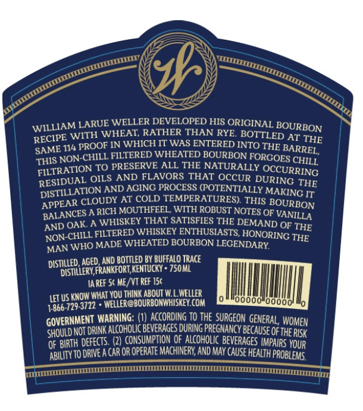
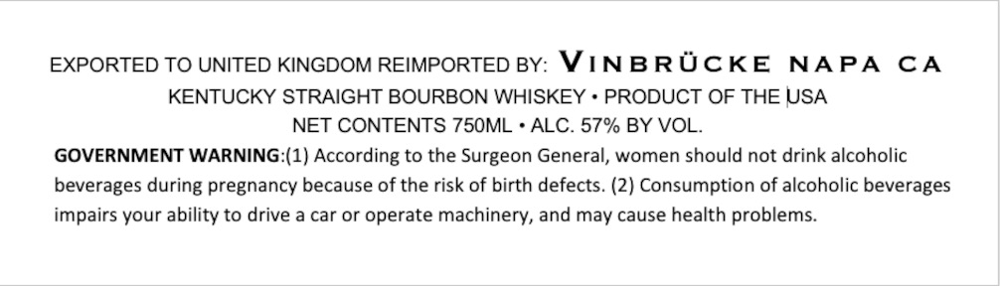

# TTB COLA Label Images - TTBID 25340001000085

**Brand Name:** WELLER

**Issue Date:** 12/09/2025

**Origin Code:** 22

**Product Class/Type:** 101

**Source:** [TTB Public COLA Registry](https://ttbonline.gov/colasonline/viewColaDetails.do?action=publicFormDisplay&ttbid=25340001000085)

## Label Images

### Back Label

### Front Label

### Label 3

## Extracted Label Text

*Text extracted via OCR - may contain errors*

*1 image(s) excluded: text did not meet readability threshold*

**Detected Proof:** 114

### Back Label

WILLIAM LARUE WELLER DEVELOPED HIS ORIGINAL
eCIPE WITH WHEAT, RATHER THAN RYE BO EON
ME 114 PROOF IN WHICH IT WAS ENTERED INTO oie AT THE
yN-CHILL FILTERED WHEATED BO! RBON FORGO, BARREL,
FILTRATION TO PRESERVE ALL THE NATURALLY aes CHILL
RESIDUAL OILS AND FLAVORS THAT OCCUR me
PISTILLATION AND AGING PROCESS (POTENTIALLY ie THE
baat \G IT
LANCES A RICH MOUTHFEEL, WITH ROBUST NOTES OF SURBON
AND OAK. A WHISKEY THAT SATISFIES THE DEA ANILLA
NON-CHILL FILTERED WHISKEY ENTHUSIASTS, HONORING THE
MAN WHO MADE WHEATED BOURBON LEGENDARY. ING THE

DISTILLED, AGED, AND BOTTLED BY BUFFALO TRACE
‘DISTILLERY, FRANKFORT, KENTUCKY » 750ML
TAREF 5¢ ME/VT REF 15¢
LET US KNOW WHAT YOU THINK ‘ABOUT W.L.WELLER
1-866-729-3722 * ‘WELLER@BOURBONWHISKEY.COM onto! ly

GOVERNMENT WARNING: (1) ACCORDING TO THE SURGEON GENERAL, w
GHOULD NOT DRINK ALCOHOLIC BEVERAGES DURING PRE ha Cah WOMEN
Of BIRTH DEFECTS. (2) CONSUMPTION OF ALCOHOLIC BEVERAGES iP ie

EMS

APPEAR CLOUDY AT COLD TEMPERATURES). THIS BO}

ABILITY TO DRIVE A CAR OR OPERATE MACHINERY, AND MAY CAUSE HEALTH PROB
BL

### Label 3

EXPORTED TO UNITED KINGDOM REIMPORTED BY: VINBRUCKE NAPA CA

KENTUCKY STRAIGHT BOURBON WHISKEY + PRODUCT OF THE USA

NET CONTENTS 750ML + ALC. 57% BY VOL.

GOVERNMENT WARNING:(1) According to the Surgeon General, women should not drink alcoholic

beverages during pregnancy because of the risk of birth defects. (2) Consumption of alcoholic beverages

impairs your ability to drive a car or operate machinery, and may cause health problems.
