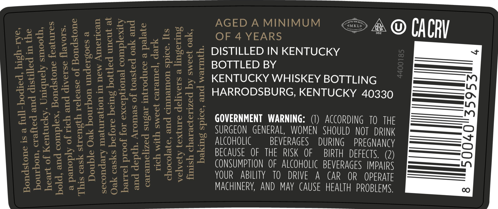
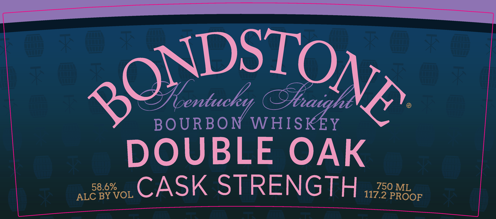

# TTB COLA Label Images - TTBID 25344001000435

**Brand Name:** BONDSTONE

**Fanciful Name:** DOUBLE OAK CASK STRENGTH

**Issue Date:** 12/12/2025

**Origin Code:** 22

**Product Class/Type:** 101

**Source:** [TTB Public COLA Registry](https://ttbonline.gov/colasonline/viewColaDetails.do?action=publicFormDisplay&ttbid=25344001000435)

## Label Images

### Back Label

### Front Label

### Label 3

## Extracted Label Text

*Text extracted via OCR - may contain errors*

*1 image(s) excluded: text did not meet readability threshold*

**Detected Proof:** 117.2
**Detected Age:** 4 Years

### Back Label

—————— So
a8 SS Boy . AGEDAMINIMUM <@ &
S2SEC sce ests SPY OF 4 YEARS i © CACRY
eaZeBES$25 FS Oe § ¥ 5S DISTILLED INKENTUCKY +
BU fe gh bse Sy y= SS 8B BOTTLEDBY —
233529848522 € & x | = KENTUCKY WHISKEY BOTTLING —!-
SS PES 62 S55 5 5 3 SSE HARRODSBURG, KENTUCKY 40330 ~—==
ABP ARPES eo a sees ay)
Ee SESS 220 © FHSS eo 2-5 GOVERNMENT WARNING: (1) ACCORDING 10 THE ———om
BEEBE PL S552 % 255 % % SURGEON GENERAL, WOMEN SHOULD NOT DRINK —s
PEESSES ELS SESS EEE ALCOHOLIC BEVERAGES DURING PREGA —e
24 ceZ epg 2S 2S 522 BECAUSE OF THE RISK OF BIRTH DEFECTS. 2) fe
SEC ESES SERS ES S22 CONSUMPTION OF ALCOHOLIC BEVERAGES IMPAIRS —=—————ia
Bebe et Sao toe ice: YOUR ABILITY 10 DRIVE A CAR OR OA —=—J
Bassak 3885S MACHINERY, AND MAY CAUSE HEALTH PROBLEMS, 00

### Front Label

SONDSTON
BOURBON WHISKEY
DOUBLE
OAK
58.6%
CASK STRENGTH
750 ML
ALC BY VOL
117.2 PROOF
