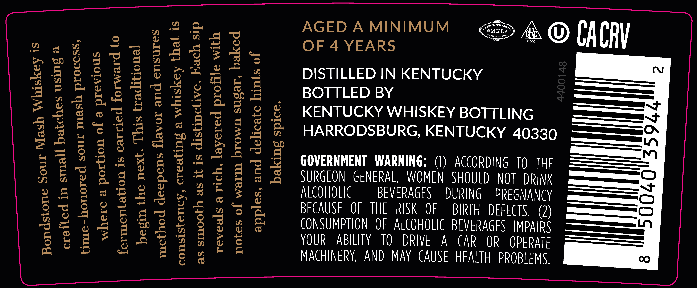
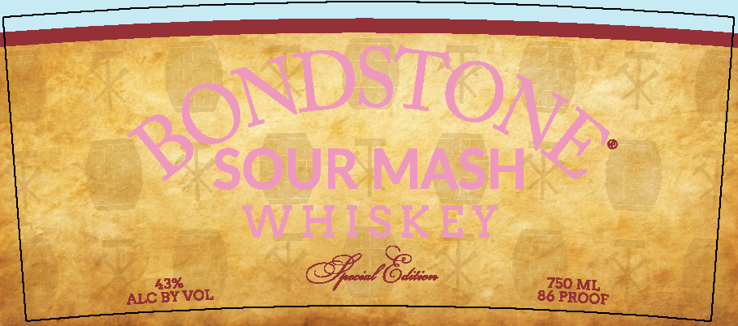

# TTB COLA Label Images - TTBID 25344001000452

**Brand Name:** BONDSTONE

**Fanciful Name:** SOUR MASH

**Issue Date:** 12/10/2025

**Origin Code:** 22

**Product Class/Type:** 140

**Source:** [TTB Public COLA Registry](https://ttbonline.gov/colasonline/viewColaDetails.do?action=publicFormDisplay&ttbid=25344001000452)

## Label Images

### Back Label

### Front Label

### Label 3

## Extracted Label Text

*Text extracted via OCR - may contain errors*

*1 image(s) excluded: text did not meet readability threshold*

**Detected Proof:** 86
**Detected Age:** 4 Years

### Back Label

AGED A MINIMUM

MKL

pear eee

OF 4 YEARS

4 © CACRV

DISTILLED IN KENTUCKY

Of 5

BOTTLED BY

KENTUCKY WHISKEY BOTTLING

HARRODSBURG, KENTUCKY 40330

GOVERNMENT WARNING: (1) ACCORDING TO THE

SURGEON GENERAL, WOMEN SHOULD NOT DRINK

ALCOHOLIC

BEVERAGES DURING PREGNANCY

BECAUSE OF THE RISK OF BIRTH DEFECTS. (2)

CONSUMPTION OF ALCOHOLIC BEVERAGES |MPAIRS

YOUR ABILITY TO DRIVE A CAR OR OPERATE

MACHINERY, AND MAY CAUSE HEALTH PROBLEMS.

### Front Label

43%
ALC BY VOL

wR.
i eek Fy “
Jha Ersin

abt PROGP

ee ee ee
