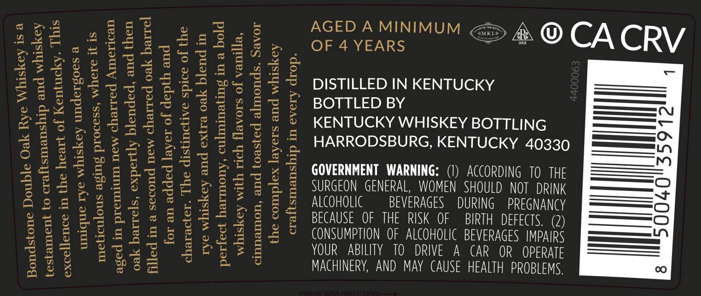
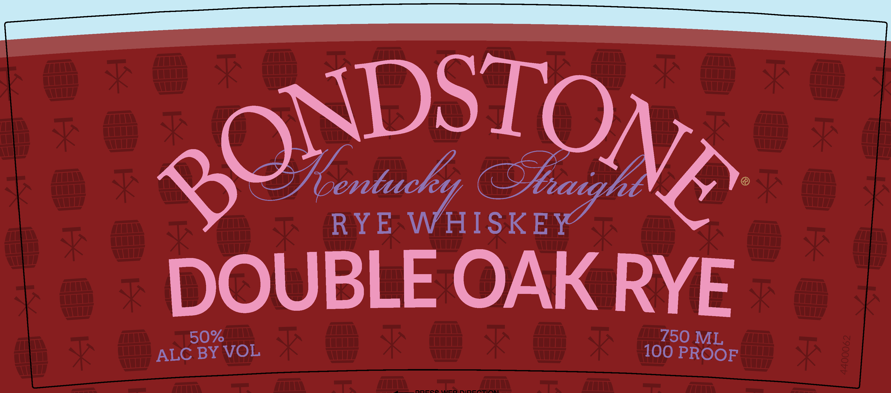

# TTB COLA Label Images - TTBID 25344001000461

**Brand Name:** BONDSTONE

**Fanciful Name:** DOUBLE OAK RYE

**Issue Date:** 12/10/2025

**Origin Code:** 22

**Product Class/Type:** 102

**Source:** [TTB Public COLA Registry](https://ttbonline.gov/colasonline/viewColaDetails.do?action=publicFormDisplay&ttbid=25344001000461)

## Label Images

### Back Label

### Front Label

### Label 3

## Extracted Label Text

*Text extracted via OCR - may contain errors*

*1 image(s) excluded: text did not meet readability threshold*

**Detected Age:** 4 Years

### Back Label

2 ACEDAMINIMUM <> #& @ CA CRY
_ ~ y
52 4888 Sakae = . OF 4 YEARS
na j= “ay fal a ne) Ga ‘a Q, —
p2333 pEZe GE: 42 = DISTILLED IN KENTUCKY ——4
Gof Bu gag a del } _—
$2558 Bast wseggs ——=<
aa PeEdse Teen ese ENTU GS) ETEICSY BOTTLING —=o
See eG EEES 8 sacs es GAMERA EVES i 20350 =
ee PESL ACHES ag RR b
SES phU St SEE Eaz se HA
4228 ae bates a OVERNMENT WARNING: (1) ACORONG 10TH —=
glee tyises bie , ERAL WOMEN SHOULD —=<i
O8 @ ‘a Op org Se ag 8 © SURGEON GEN , ING PREGNANCY —
TELS EEE’ ELE Gitamere ant a ——=
EE bpadioa: CAUSE OFTHE torn aEVERMGES MARS —
gS 554 Y Sa2S5 8s AIC
eegkekeedd Se 22 2 Mmm tee eae ==
tee 5283 2 Your ui y AAY CAUSE HEALTH PROBLEMS,
3525245 gers MACHINERY, AND
Bee Regs 78
B3% Jia

### Front Label

Ree

RYE lente A

eh, BO

DOUBLE OAK RYE
