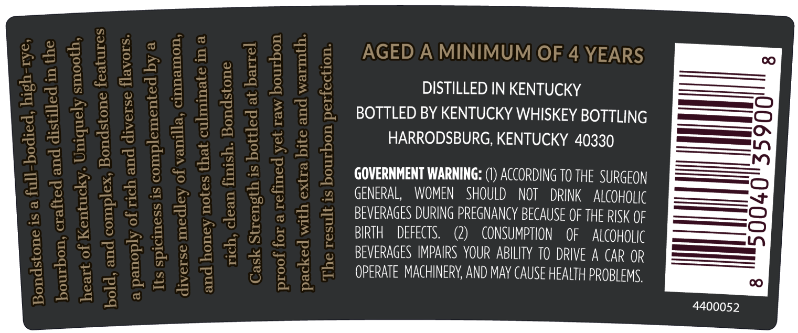
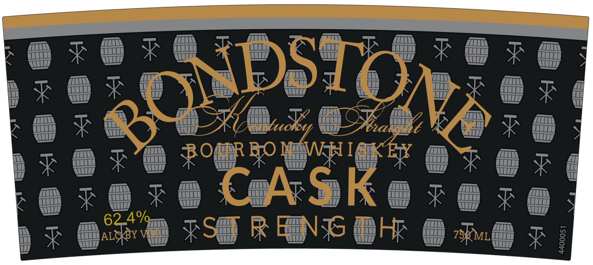

# TTB COLA Label Images - TTBID 25344001000474

**Brand Name:** BONDSTONE

**Fanciful Name:** CASK STRENGTH

**Issue Date:** 12/10/2025

**Origin Code:** 22

**Product Class/Type:** 101

**Source:** [TTB Public COLA Registry](https://ttbonline.gov/colasonline/viewColaDetails.do?action=publicFormDisplay&ttbid=25344001000474)

## Label Images

### Back Label

### Front Label

### Label 3

## Extracted Label Text

*Text extracted via OCR - may contain errors*

*2 image(s) excluded: text did not meet readability threshold*

**Detected Age:** 4 Years

### Back Label

fi I_bodied, high rye,

Bondstone is a

o
oe

i
=]
=|
9
n
a
a
cS)
ig

%
a
a
Pe)

diverse medley of v

and honey notes that cult

rich, clean finish. Bor

‘ined yet raw bourbon

packed with extra bite and warmth.

The result is bou

AGED A MINIMUM OF 4 YEARS

DISTILLED IN KENTUCKY
BOTTLED BY KENTUCKY WHISKEY BOTTLING
HARRODSBURG, KENTUCKY 40330

GOVERNMENT WARNING: (1) ACCORDING 10 THE SURGEON
GENERAL, WOMEN SHOULD NOT DRINK ALCOHOLIC
BEVERAGES DURING PREGNANCY BECAUSE OF THE RISK OF
BIRTH DEFECTS. (2) CONSUMPTION OF ALCOHOLIC
BEVERAGES IMPAIRS YOUR ABILITY TO DRIVE A CAR OR
OPERATE MACHINERY, AND MAY CAUSE HEALTH PROBLEMS,

4400052
