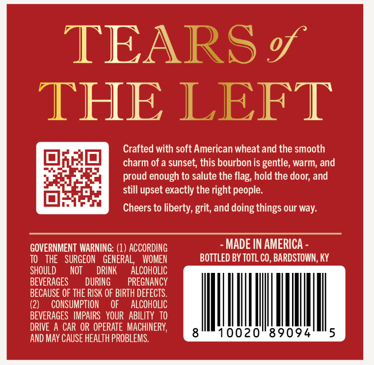
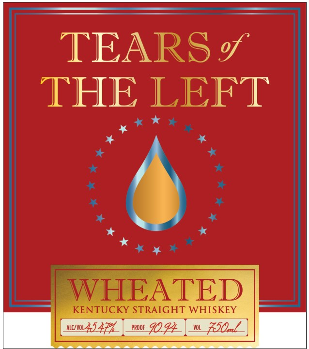
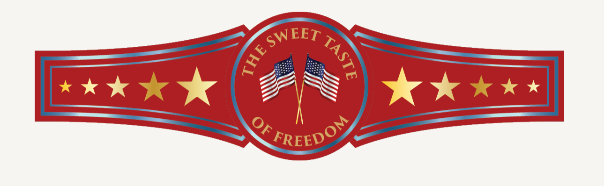

# TTB COLA Label Images - TTBID 25344001000590

**Brand Name:** TEARS OF THE LEFT

**Issue Date:** 01/08/2026

**Origin Code:** 22

**Product Class/Type:** 100

**Source:** [TTB Public COLA Registry](https://ttbonline.gov/colasonline/viewColaDetails.do?action=publicFormDisplay&ttbid=25344001000590)

## Label Images

### Back Label

### Label 1

### Label 3

## Extracted Label Text

*Text extracted via OCR - may contain errors*

*1 image(s) excluded: text did not meet readability threshold*

### Back Label

TEARS %
THE LEFT

Crafted with soft American wheat and the smooth
charm of a sunset, this bourbon is gentle, warm, and
proud enough to salute the flag, hold the door, and
still upset exactly the right people.

Cheers to liberty, grit, and doing things our way.

GOVERNMENT WARNING: (1) ACCORDING
TO THE SURGEON GENERAL, WOMEN
SHOULD NOT DRINK ALCOHOLIC
BEVERAGES DURING — PREGNANCY
BECAUSE OF THE RISK OF BIRTH DEFECTS.
(2) CONSUMPTION OF ALCOHOLIC
BEVERAGES IMPAIRS YOUR ABILITY 10
DRIVE A CAR OR OPERATE MACHINERY,
AND MAY CAUSE HEALTH PROBLEMS.

- MADE IN AMERICA -
BOTTLED BY TOTL CO, BARDSTOWN, KY

810020 89094

### Label 1

TEARS

THE LEFT

*

+

* ¥

A

y J

RAIGHT WH ISKEY

PROOF

PROOF

Fle
