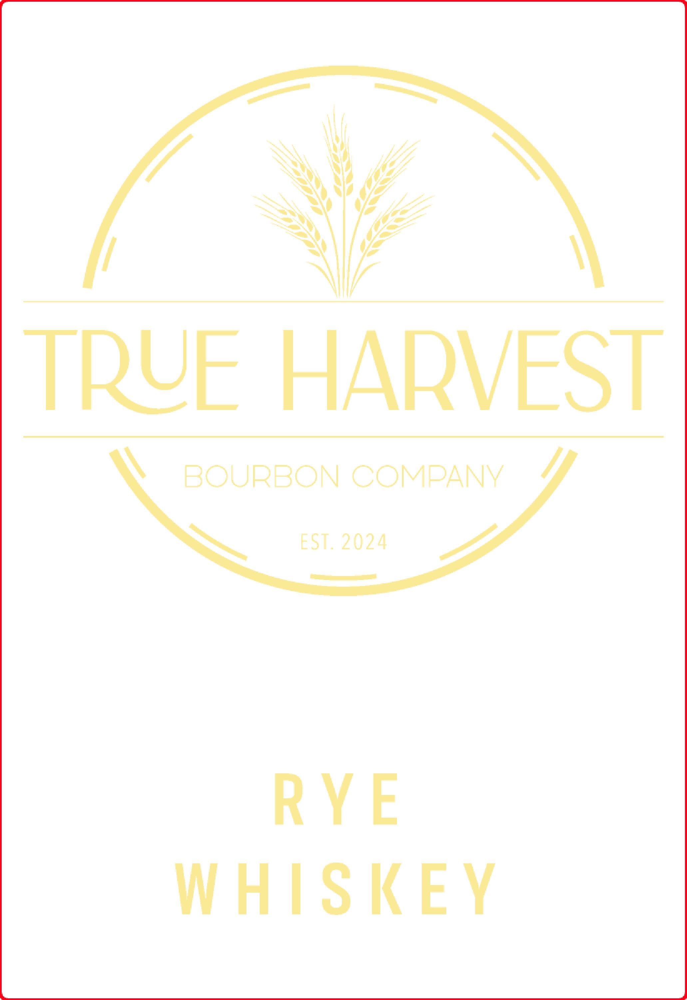
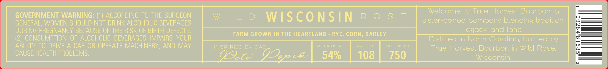

# TTB COLA Label Images - TTBID 25346001000231

**Brand Name:** TRUE HARVEST

**Issue Date:** 02/02/2026

**Origin Code:** 48

**Product Class/Type:** 142

**Source:** [TTB Public COLA Registry](https://ttbonline.gov/colasonline/viewColaDetails.do?action=publicFormDisplay&ttbid=25346001000231)

## Label Images

### Label 1

### Label 2

## Extracted Label Text

*Text extracted via OCR - may contain errors*

### Label 1

\

TRYE HARVES

\ BOURBON COMPANY Y/
We EST. 2024 AZ

RYE
WHISKEY

### Label 2

Welcome to True Harvest Bourbon. a

GOVERNMENT WARNING: (1) ACCORDING TO THE SURGEON

GENERAL, WOMEN SHOULD NOT DRINK ALCOHOLIC BEVERAGES

sister-owned company blending tradition.

DURING PREGNANCY BECAUSE OF THE RISK OF BIRTH DEFECTS

legacy. and land.

| FARM GROWN INTHE HEARTLAND - RYE, CORN, BARLEY | FARM GROWN INTHE HEARTLAND - RYE, CORN, BARLEY IN THE HEARTLAND - RYE, CORN, BARLEY

ABILITY TO DRIVE A CAR OR OPERATE MACHINERY, AND MAY

(2) CONSUMPTION OF ALCOHOLIC BEVERAGES IMPAIRS YOUR

SIZE IN ML

Distilled in North Carolina, bottled by

INSPIRED BY DAD

True Harvest Bourbon in Wild Rose

CAUSE HEALTH PROBLEMS

ete EN ce

750

Wisconsin
