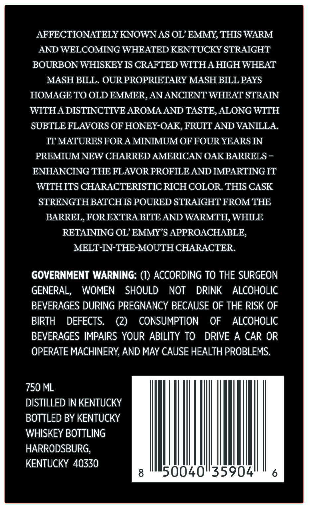
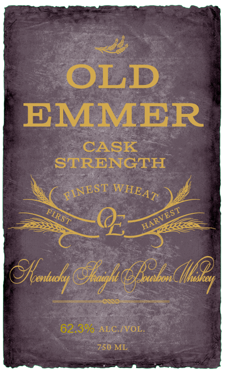

# TTB COLA Label Images - TTBID 25346001000536

**Brand Name:** OLD EMMER

**Fanciful Name:** CASK STRENGTH

**Issue Date:** 12/15/2025

**Origin Code:** 22

**Product Class/Type:** 101

**Source:** [TTB Public COLA Registry](https://ttbonline.gov/colasonline/viewColaDetails.do?action=publicFormDisplay&ttbid=25346001000536)

## Label Images

### Back Label

### Label 1

## Extracted Label Text

*Text extracted via OCR - may contain errors*

### Back Label

AFFECTIONATELY KNOWN AS OL’ EMMY, THIS WARM

AND WELCOMING WHEATED KENTUCKY STRAIGHT

BOURBON WHISKEY IS CRAFTED WITH A HIGH WHEAT

MASH BILL. OUR PROPRIETARY MASH BILL PAYS

HOMAGE TO OLD EMMER, AN ANCIENT WHEAT STRAIN

WITH A DISTINCTIVE AROMA AND TASTE, ALONG WITH

SUBTLE FLAVORS OF HONEY-OAK, FRUIT AND VANILLA.

IT MATURES FOR A MINIMUM OF FOUR YEARS IN

PREMIUM NEW CHARRED AMERICAN OAK BARRELS -

ENHANCING THE FLAVOR PROFILE AND IMPARTING IT

WITHITS CHARACTERISTIC RICH COLOR. THIS CASK

STRENGTH BATCH IS POURED STRAIGHT FROM THE

BARREL, FOR EXTRA BITE AND WARMTH, WHILE

RETAINING OL’ EMMY’S APPROACHABLE

MELT-IN-THE-MOUTH CHARACTER

GOVERNMENT WARNING: (1) ACCORDING TO THE SURGEON

GENERAL,

WOMEN SHOULD NOT DRINK ALCOHOLIC

BEVERAGES DURING PREGNANCY BECAUSE OF THE RISK OF

BIRTH DEFECTS,

(2) CONSUMPTION OF ALCOHOLIC

BEVERAGES IMPAIRS YOUR ABILITY TO DRIVE A CAR OR

OPERATE MACHINERY, AND MAY CAUSE HEALTH PROBLEMS

750 ML

DISTILLED IN KENTUCKY

BOTTLED BY KENTUCKY

WHISKEY BOTTLING

HARRODSBURG,

KENTUCKY 40330

Ih.

50040

### Label 1

OLD
EMMER
CASK
STRENGTH
@zuopes(t?
62.3%0-ALC IVOL .
750 ML
FINEST
WHEAT
HARVEST
FIRST
GKao (
