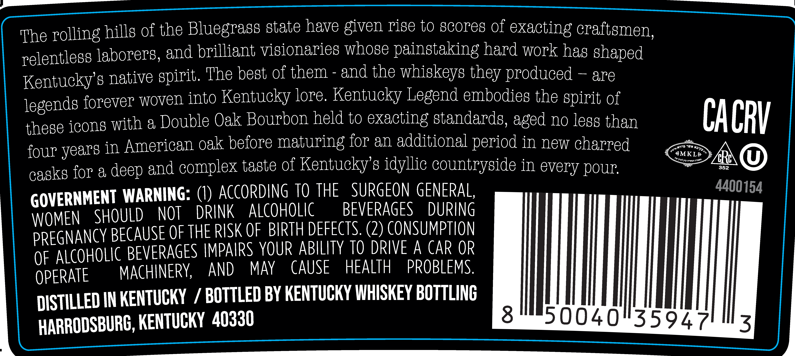

# TTB COLA Label Images - TTBID 25349001000203

**Brand Name:** KENTUCKY LEGEND

**Fanciful Name:** DOUBLE OAK

**Issue Date:** 12/15/2025

**Origin Code:** 22

**Product Class/Type:** 101

**Source:** [TTB Public COLA Registry](https://ttbonline.gov/colasonline/viewColaDetails.do?action=publicFormDisplay&ttbid=25349001000203)

## Label Images

### Back Label

### Front Label

### Label 3

## Extracted Label Text

*Text extracted via OCR - may contain errors*

*1 image(s) excluded: text did not meet readability threshold*

### Back Label

The rolling hills of the Bluegrass state have given rise to scores of exacting craftsmen,
relentless laborers, and brilliant visionaries whose painstaking hard work has shaped
Kentucky's native spirit. The best of them - and the whiskeys they produced — are
legends forever woven into Kentucky lore. Kentucky Legend embodies the spirit of
thege icons with a Double Oak Bourbon held to exacting standards, aged no less than CA CP /
four years in American oak before maturing for an additional period in new charred tm
casks for a deep and complex taste ol Kentucky's idyllic countryside in every pour SEAR ()
GOVERNMENT WARNING: (1) ACCORDING TO THE SURGEON GENERAL, 4400154
WOMEN SHOULD NOT DRINK ALCOHOLIC =BEVERAGES DURING
PREGNANCY BECAUSE OF THE RISK OF BIRTH DEFECTS. (2) CONSUMPTION

OF ALCOHOLIC BEVERAGES IMPAIRS YOUR ABILITY TO DRIVE A CAR OR
OPERATE MACHINERY, AND MAY CAUSE HEALTH PROBLEMS.

DISTILLED IN KENTUCKY / BOTTLED BY KENTUCKY WHISKEY BOTTLING
HARRODSBURG, KENTUCKY 40330 3 MI50040"35947 z

### Front Label

ee

EN

KENTUCKY LEGEND

DOUBLE OAK

Z5-071

Batch

Proot

gO

Made in Kentucky

Alc by Vol

USL

KENTUCKY STRAIGHT BOURBON WHISKEY

730 ML
