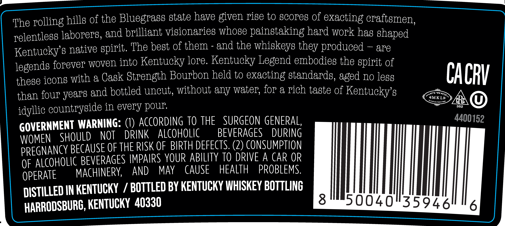

# TTB COLA Label Images - TTBID 25349001000211

**Brand Name:** KENTUCKY LEGEND

**Fanciful Name:** CASK STRENGTH

**Issue Date:** 12/15/2025

**Origin Code:** 22

**Product Class/Type:** 101

**Source:** [TTB Public COLA Registry](https://ttbonline.gov/colasonline/viewColaDetails.do?action=publicFormDisplay&ttbid=25349001000211)

## Label Images

### Back Label

### Front Label

### Label 3

## Extracted Label Text

*Text extracted via OCR - may contain errors*

*1 image(s) excluded: text did not meet readability threshold*

**Detected Proof:** 127.4

### Back Label

The rolling hills f the Bluegrass state have given rige to gcoreg of exacting caftemen;
Telentlegg laborerg, and brilliant vigionarieg whose paingtaking hard work has shaped
Kentucky'8 native spirit The best of them
and the whigkeys they produced
are
legends forever Woven into Kentucky lore Kentucky Iegend embodie8 the epirit of
these icong with a Cask Strength Bourbon held to exacting standards,
no le8s
CACRV
four
and bottled uncut; without any water; for a rich taste of Kentuckyg
than
~MKL&
'InbppnNU37Iaut
83
idyllic countryside in every pOUE
352
GOVERNMENT WARNING: (9) ACCORDING To The
SURGEON GENERAL;
4400152
WOMEN
SHOULD
NOT
DRINK
ALCoHOLIC
BEVERAGES
DURING
PREGNANCY BECause oe the RISK OF BIRTH deFEcts; (2) ConsuMpTIOn
ALCOHOLIc BEVERAGES IMPAIRS YouR ABILITY To DRIVE A CAr OR
OF
OPERATE
MACHNERY,
AND
MAY
CAUSE
HEALTH
PROBLEMS
DISTILLED IN KENTUCKY
1
BOTTLED BY KENTUCKY WHISKEY BOTTLINC
HARRODSBURC, KENTUCKY  40330
8
50040"35946
aged
years
NzP"

### Front Label

KENTUCKY LEGEND
CASK STRENGTH
Z5-071

Batch —~&—z2~—_—
Proof 127.4 (KL)
Made in Kentucky
Alc by Vol GTh

KENTUCKY STRAIGHT BOURBON WHISKEY

750 ML
