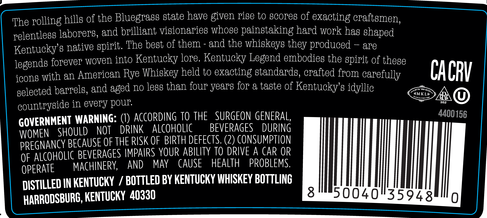

# TTB COLA Label Images - TTBID 25349001000228

**Brand Name:** KENTUCKY LEGEND

**Issue Date:** 12/16/2025

**Origin Code:** 22

**Product Class/Type:** 102

**Source:** [TTB Public COLA Registry](https://ttbonline.gov/colasonline/viewColaDetails.do?action=publicFormDisplay&ttbid=25349001000228)

## Label Images

### Back Label

### Front Label

### Label 3

## Extracted Label Text

*Text extracted via OCR - may contain errors*

*1 image(s) excluded: text did not meet readability threshold*

### Back Label

The rolling hills of the Bluegrass state have given rige to gcore8 of exacting caftemen;
Telentlegg laborerg, and brilliant vigionarieg whose paingtaking hard work has shaped
Kentucky8 native
The best of them
and the whigkeys they produced
are
legends forever Woven into Kentucky lore Kentucky Legend embodieg the Gpirit of these
icon8
an American
Whiskey held to exacting standards, crafted from carefully
CACRV
gelected barrel8; and
no legs than four years for & taste of
Kentucky 8 idyllic
Apn
#MKL&
'Dobpyp M7k37
Rc
countrygide in every DOuP
352
GOVERNMENT WARNING: (0) AcCoRDING To THE
SURGEON GENERAL;
4400156
WOMEN
SHOULD
NOT
DRINK
alCoHOLIC
BEVERAGES
DURING
PREGNAncy BECause oFTHe RISK OF BIRth defECTS  (2) CONSUMPTION
ALCOHOLIC BEVERAGES IMPAIRS YOUR ABILITY TQ DRIVE A car OR
OF
OPERATE
MACHINERY,
AND
MAY
CAUSE
HEALTH
PROBLEMS.
DISTILLED IN KENTUCKY
7
BOTTLED BY KENTUCKY WHISKEY BOTTLINC
HARRODSBURG, KENTUCKY   40330
8
50040435948-
spirit.
Rye
with
aged
Kntb
Ma P} :
Urtd

### Front Label

KENTUCKY LEGEND

25-071

Batch

Proof

_ 40

Made in Kentucky

Alc by Vol

UST.

KENTUCKY STRAIGHT RYE WHISKEY

730 ML
