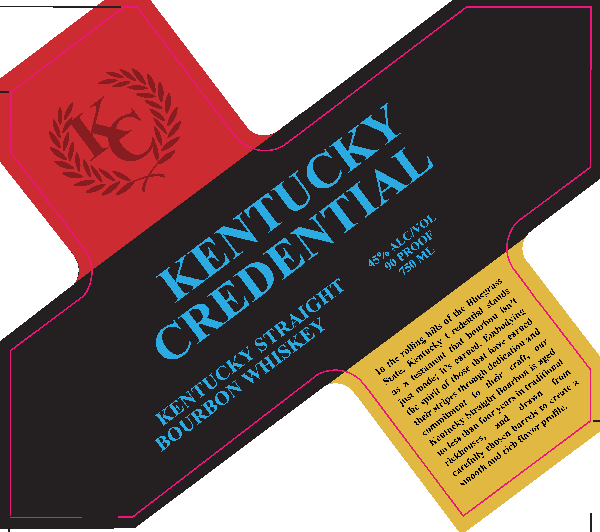

# TTB COLA Label Images - TTBID 25349001000258

**Brand Name:** KENTUCKY CREDENTIAL

**Issue Date:** 12/16/2025

**Origin Code:** 22

**Product Class/Type:** 101

**Source:** [TTB Public COLA Registry](https://ttbonline.gov/colasonline/viewColaDetails.do?action=publicFormDisplay&ttbid=25349001000258)

## Label Images

### Back Label

### Label 1

## Extracted Label Text

*Text extracted via OCR - may contain errors*

### Back Label

DISTILLED IN KENTUCKY

MKL

& ©

BOTTLED BY KENTUCKY

WHISKEY BOTTLING

HARRODSBURG, KY 40550

4400159 yl URV

GOVERNMENT WARNING

(1)

ACCORDING TQ THE SURGEON

GENERAL, WOMEN SHOULD NOT

DRINK ALCOHOLIC BEVERAGES

DURING PREGNANCY BECAUSE OF

THE RISK OF BIRTH DEFECTS. (2)

CONSUMPTION OF ALCOHOLIC

BEVERAGES

IMPAIRS

YOUR

ABILITY TQ DRIVE A CAR OR

OPERATE MACHINERY, AND MAY

CAUSE HEALTH PROBLEMS

### Label 1

(o
3S
2
6
a
49
*o
30
*o
L4
KENTUCKY
CREDENTIAL
ALCNOL
PROOF
ML
45%/
90
750
Bluegrass
STRAIGHT
stands
isn  t
the
Credential
Embodying
bourbon
of
WHISKEY
earned
hills
and
rolling
that
Kentucky
have
our
dedication
earned
KENTUCKY
aged
testament
that
craft,
the
traditional
it s
those
State,
through
Bourbon
from
their
made;
BOURBON
create
spirit
stripes
drawn
just
Straight
years
commitment
the
profile.
barrels
their
four
and
Kentucky
than
flavor
chosen
rickhouses,
less -
rich
no
carefully
and
smooth
