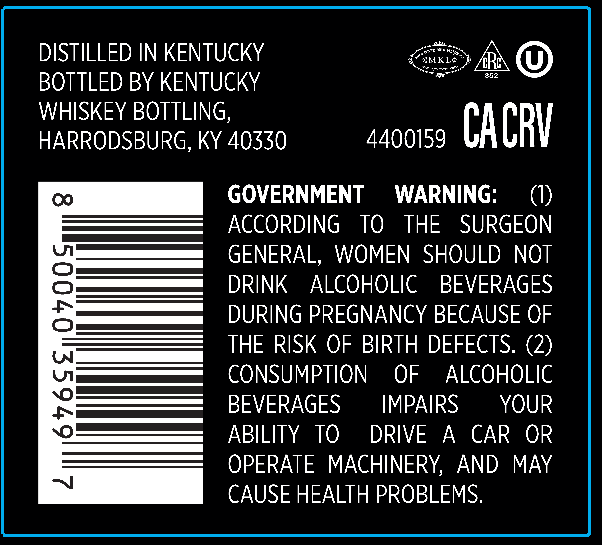
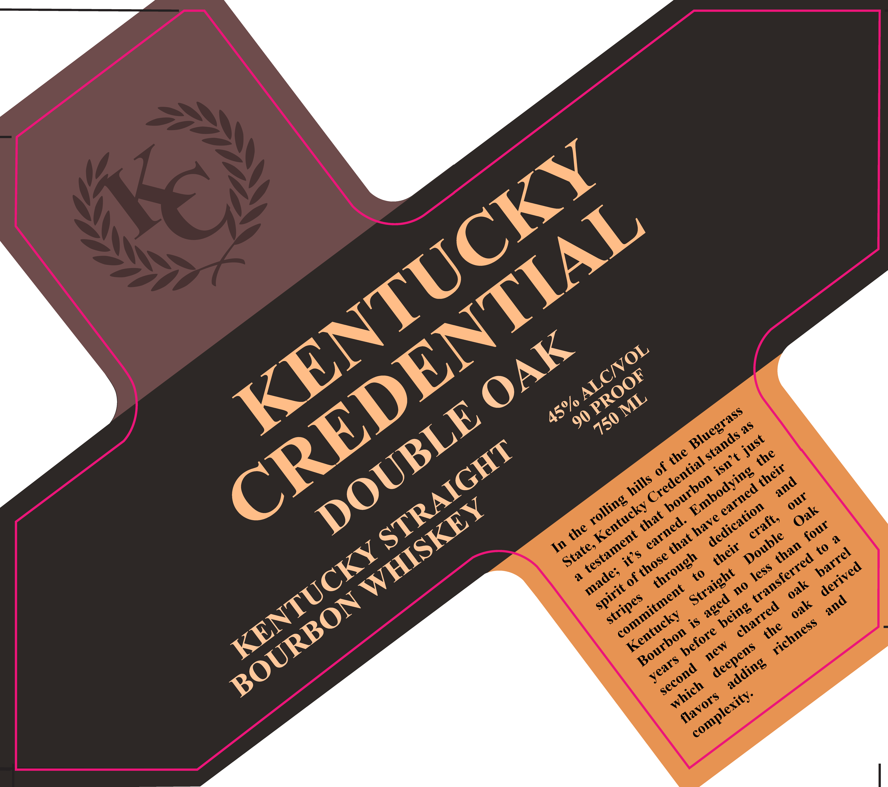

# TTB COLA Label Images - TTBID 25349001000275

**Brand Name:** KENTUCKY CREDENTIAL

**Fanciful Name:** DOUBLE OAK

**Issue Date:** 12/16/2025

**Origin Code:** 22

**Product Class/Type:** 101

**Source:** [TTB Public COLA Registry](https://ttbonline.gov/colasonline/viewColaDetails.do?action=publicFormDisplay&ttbid=25349001000275)

## Label Images

### Back Label

### Label 1

## Extracted Label Text

*Text extracted via OCR - may contain errors*

### Back Label

DISTILLED IN KENTUCKY

MKL

& ©

BOTTLED BY KENTUCKY

WHISKEY BOTTLING

HARRODSBURG, KY 40550

4400159 yl URV

GOVERNMENT WARNING

(1)

ACCORDING TQ THE SURGEON

GENERAL, WOMEN SHOULD NOT

DRINK ALCOHOLIC BEVERAGES

DURING PREGNANCY BECAUSE OF

THE RISK OF BIRTH DEFECTS. (2)

CONSUMPTION OF ALCOHOLIC

BEVERAGES

IMPAIRS

YOUR

ABILITY TQ DRIVE A CAR OR

OPERATE MACHINERY, AND MAY

CAUSE HEALTH PROBLEMS

### Label 1

90
6
0
(o
Ko
6
*o
3S
KENTUCKY
CREDENTIAL
OAK
ALCNOL
PROOF
ML
45%/
DOUBLE
Bluegrass
750
as
stands
just
STRAIGHT
the
the
isn t
Credential
their
Embodying
hills
bourbon
and
earned
our
rolling
WHISKEY
Kentucky
dedication
Oak
that
have
craft,
earned.
four
the
testament
Double
that
State;
KENTUCKY
their
than
barrel
its
those
through
transferred
derived
less
made;
Straight
oak
no
spirit
commitment
BOURBON
stripes
aged
and
oak
charred
being
Kentucky
richness
the
before
Bourbon
new
deepens
years
adding
second
which
complexity:
flavors
