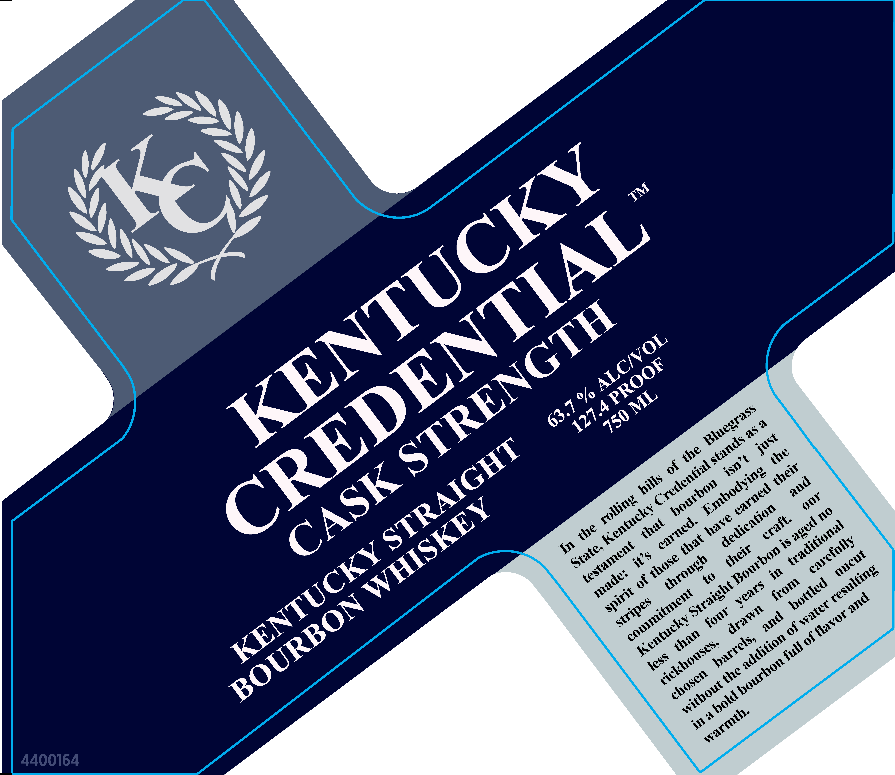

# TTB COLA Label Images - TTBID 25349001000286

**Brand Name:** KENTUCKY CREDENTIAL

**Fanciful Name:** CASK STRENGTH

**Issue Date:** 12/16/2025

**Origin Code:** 22

**Product Class/Type:** 101

**Source:** [TTB Public COLA Registry](https://ttbonline.gov/colasonline/viewColaDetails.do?action=publicFormDisplay&ttbid=25349001000286)

## Label Images

### Back Label

### Front Label

## Extracted Label Text

*Text extracted via OCR - may contain errors*

**Detected Proof:** 127.4

### Back Label

DISTILLED IN KENTUCKY

MKL

& ©

BOTTLED BY KENTUCKY

WHISKEY BOTTLING

HARRODSBURG, KY 40550

4400159 yl URV

GOVERNMENT WARNING

(1)

ACCORDING TQ THE SURGEON

GENERAL, WOMEN SHOULD NOT

DRINK ALCOHOLIC BEVERAGES

DURING PREGNANCY BECAUSE OF

THE RISK OF BIRTH DEFECTS. (2)

CONSUMPTION OF ALCOHOLIC

BEVERAGES

IMPAIRS

YOUR

ABILITY TQ DRIVE A CAR OR

OPERATE MACHINERY, AND MAY

CAUSE HEALTH PROBLEMS

### Front Label

^
6
(o
3S
6
*o
30
6
4400164
4o
KENTUCKY
TM
CREDENTIAL
STRENGTH
ALCNOL
127.4 PROOF
63.7 %
ML
Bluegrass
750
as
just
stands
STRAIGHT
the
the
isn t
Credential
CASK
their
Embodying
hills
and
bourbon
earned
our
rolling
WHISKEY
Kentucky
dedication
no
have
craft;
aged
earned.
that
traditional
the
that
carefully
testament
KENTUCKY
State;
their
Bourbon
uncut
it's
those
through
resulting
made;
bottled
from
Straight
years
spirit
commitment
and
BOURBON
stripes
water
drawn
four
of flavor
and
Kentucky
than
addition
barrels;
rickhouses;
full
less
bourbon
the
chosen
without
bold
warmth:
in a
