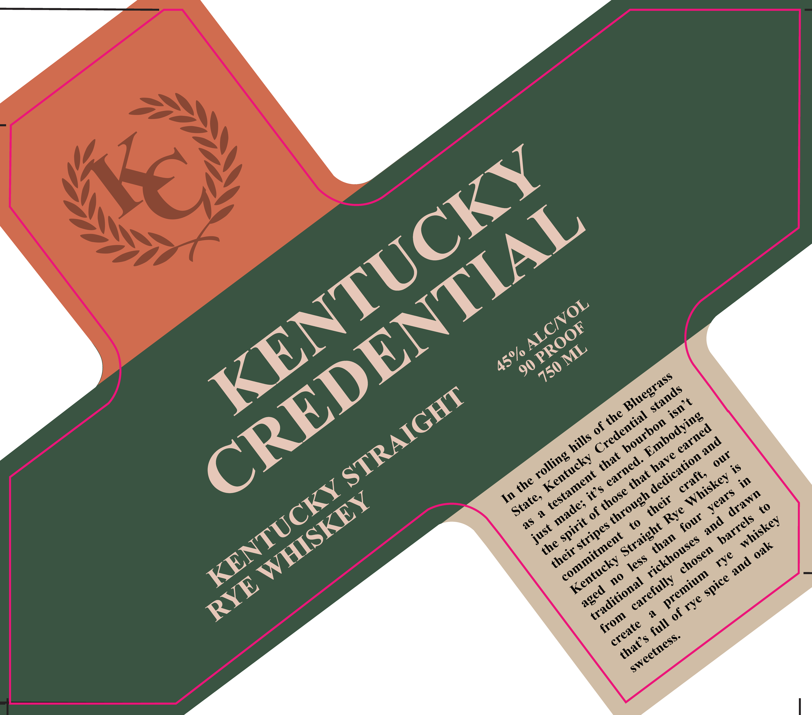

# TTB COLA Label Images - TTBID 25349001000295

**Brand Name:** KENTUCKY CREDENTIAL

**Issue Date:** 12/16/2025

**Origin Code:** 22

**Product Class/Type:** 102

**Source:** [TTB Public COLA Registry](https://ttbonline.gov/colasonline/viewColaDetails.do?action=publicFormDisplay&ttbid=25349001000295)

## Label Images

### Back Label

### Label 1

## Extracted Label Text

*Text extracted via OCR - may contain errors*

### Back Label

DISTILLED IN KENTUCKY

MKL

& ©

BOTTLED BY KENTUCKY

WHISKEY BOTTLING

HARRODSBURG, KY 40550

4400159 yl URV

GOVERNMENT WARNING

(1)

ACCORDING TQ THE SURGEON

GENERAL, WOMEN SHOULD NOT

DRINK ALCOHOLIC BEVERAGES

DURING PREGNANCY BECAUSE OF

THE RISK OF BIRTH DEFECTS. (2)

CONSUMPTION OF ALCOHOLIC

BEVERAGES

IMPAIRS

YOUR

ABILITY TQ DRIVE A CAR OR

OPERATE MACHINERY, AND MAY

CAUSE HEALTH PROBLEMS

### Label 1

90
6
3S
30
(a
2
6
*o
49
*o
0
6
KENTUCKY
CREDENTIAL
ALCNOL
PROOF
ML
45%/
750
Bluegrass
stands
STRAIGHT
isn t
the
Credential
Embodying
bourbon
earned
hills
and
our
rolling
that
have
dedication
Kentucky
earned.
testament
that
craft,
Whiskey
the
KENTUCKY
it $
those
years
drawn
through
WHISKEY
State,
their
made;
Rye
four
barrels
and
whiskey
spirit
stripes
Straight
just
commitment
than
rickhouses
the
oak
their
chosen
rye
less
Kentucky
and
premium
no
spice
carefully
traditional
RYE
aged
rye
from
full
create
sweetness.
that's
