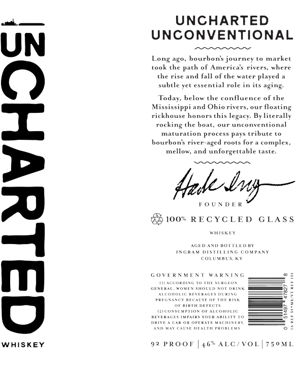

# TTB COLA Label Images - TTBID 25351001000420

**Brand Name:** UNCHARTED

**Issue Date:** 02/25/2026

**Origin Code:** 43

**Product Class/Type:** 140

**Source:** [TTB Public COLA Registry](https://ttbonline.gov/colasonline/viewColaDetails.do?action=publicFormDisplay&ttbid=25351001000420)

## Label Images

### Front Label

## Extracted Label Text

*Text extracted via OCR - may contain errors*

**Detected Proof:** 92

### Front Label

kL —

UNCHARTED

UNCONVENTIONAL

UN

Long ago, bourbon’s journey to market

took the

ath of America’s rivers, where

the rise

nd fall of the water played a

subtle yet essential role in its aging.

To.

below the confluence of the

Mississippi and Ohio rivers, our floating

rickhouse honors this legacy. By literally

rocki

the boat, our unconventional

mat

bourbo

ion process pays tribute to

's river-aged roots for a complex,

mellow, and unforgettable taste.

fede-biy—

FOUNDER

88

100

RECYCLED GLASS

wise

AGED AND BOTTLED BY

INGHAM DISTIELING COMPANY

OLUMBUS. KY

GOVERNM

1b WARNING

exteat

vin sor

we

m

04

Fs

re

ou

nevenacrs nwrain

we amiutt

PeaTe wa

WHISKEY

92 PROOF

46

ALC

VoL

750ML
