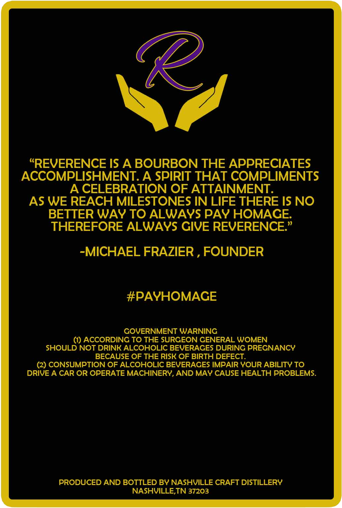
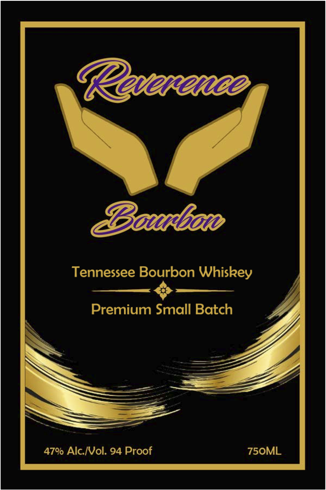

# TTB COLA Label Images - TTBID 25351001000893

**Brand Name:** REVERENCE

**Issue Date:** 02/04/2026

**Origin Code:** 43

**Product Class/Type:** 141

**Source:** [TTB Public COLA Registry](https://ttbonline.gov/colasonline/viewColaDetails.do?action=publicFormDisplay&ttbid=25351001000893)

## Label Images

### Back Label

### Label 1

### Label 3

## Extracted Label Text

*Text extracted via OCR - may contain errors*

*1 image(s) excluded: text did not meet readability threshold*

### Back Label

KC CES
“REVERENCE IS A BOURBON THE APPRECIATES
ACCOMPLISHMENT. A SPIRIT THAT COMPLIMENTS
A CELEBRATION OF ATTAINMENT.
AS WE REACH MILESTONES IN LIFE THERE IS NO
BETTER WAY TO ALWAYS PAY HOMAGE.
THEREFORE ALWAYS GIVE REVERENCE.”
-MICHAEL FRAZIER , FOUNDER
#PAYHOMAGE
GOVERNMENT WARNING
(1) ACCORDING TO THE SURGEON GENERAL WOMEN
SHOULD NOT DRINK ALCOHOLIC BEVERAGES DURING PREGNANCY
BECAUSE OF THE RISK OF BIRTH DEFECT.

(2) CONSUMPTION OF ALCOHOLIC BEVERAGES IMPAIR YOUR ABILITY TO
DRIVE A CAR OR OPERATE MACHINERY, AND MAY CAUSE HEALTH PROBLEMS.
PRODUCED AND BOTTLED BY NASHVILLE CRAFT DISTILLERY
NASHVILLE,TN 37203

### Label 1

Tennessee Bourbon Whiskey

Premium Small Batch

47% Alc./Vol. 94 Proof
