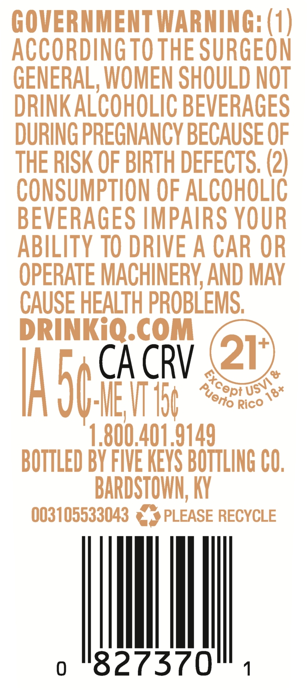
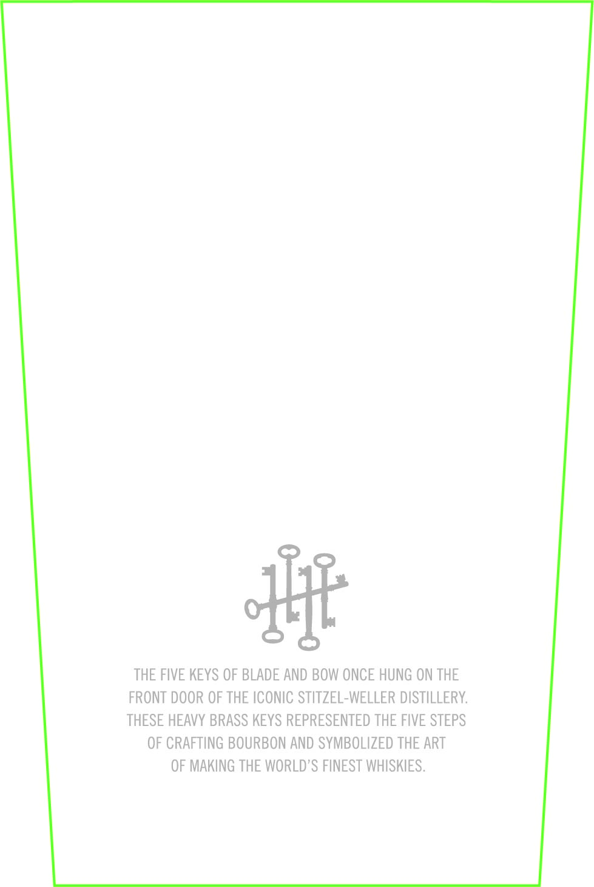
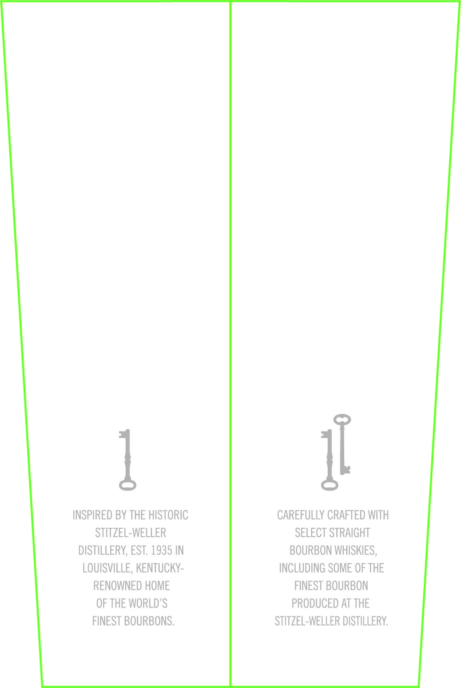
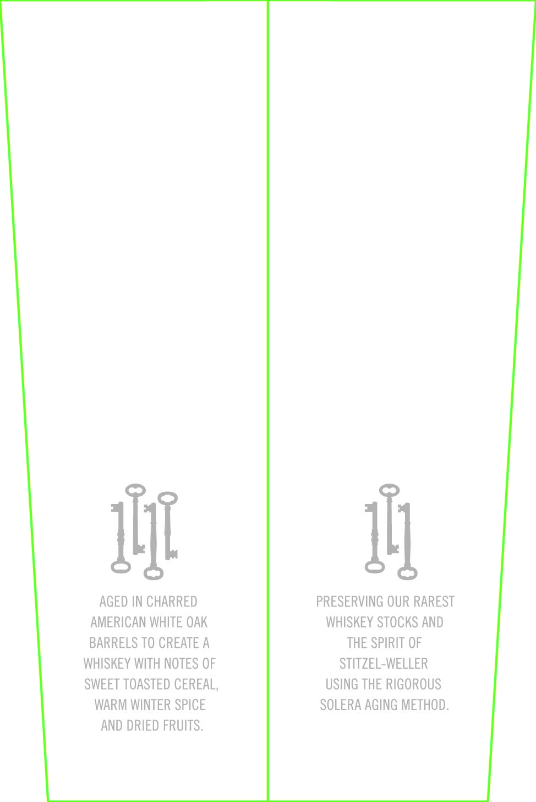

# TTB COLA Label Images - TTBID 25357001000108

**Brand Name:** BLADE AND BOW

**Fanciful Name:** SOLERA RESERVE

**Issue Date:** 01/08/2026

**Origin Code:** 22

**Product Class/Type:** 121

**Source:** [TTB Public COLA Registry](https://ttbonline.gov/colasonline/viewColaDetails.do?action=publicFormDisplay&ttbid=25357001000108)

## Label Images

### Back Label

### Label 5

### Label 6

### Label 7

### Label 8

## Extracted Label Text

*Text extracted via OCR - may contain errors*

### Back Label

CA CRV

i]

4

|

|

1

### Label 6

THE FIVE KEYS OF BLADE AND BOW ONCE HUNG ON THE

FRONT DOOR OF THE ICONIC STITZEL-WELLER DISTILLERY.

THESE HEAVY BRASS KEYS REPRESENTED THE FIVE STEPS

OF CRAFTING BOURBON AND SYMBOLIZED THE ART

OF MAKING THE WORLD’S FINEST WHISKIES.

### Label 7

Il

INSPIRED BY THE HISTORIC

CAREFULLY CRAFTED WITH

STITZEL-WELLER

SELECT STRAIGHT

DISTILLERY, EST. 1935 IN

BOURBON WHISKIES,

LOUISVILLE, KENTUCKY-

INCLUDING SOME OF THE

RENOWNED HOME

FINEST BOURBON

OF THE WORLD'S

PRODUCED AT THE

FINEST BOURBONS.

STITZEL-WELLER DISTILLERY.

### Label 8

ili

ll

AGED IN CHARRED

PRESERVING OUR RAREST

AMERICAN WHITE OAK

WHISKEY STOCKS AND

BARRELS TO CREATE A

THE SPIRIT OF

WHISKEY WITH NOTES OF

STITZEL-WELLER

SWEET TOASTED CEREAL

USING THE RIGOROUS

WARM WINTER SPICE

SOLERA AGING METHOD.

AND DRIED FRUITS.
