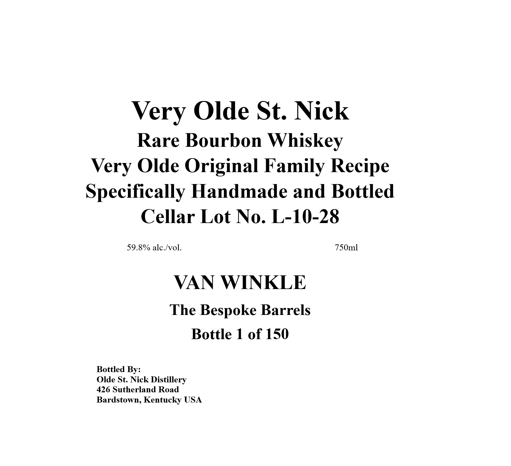
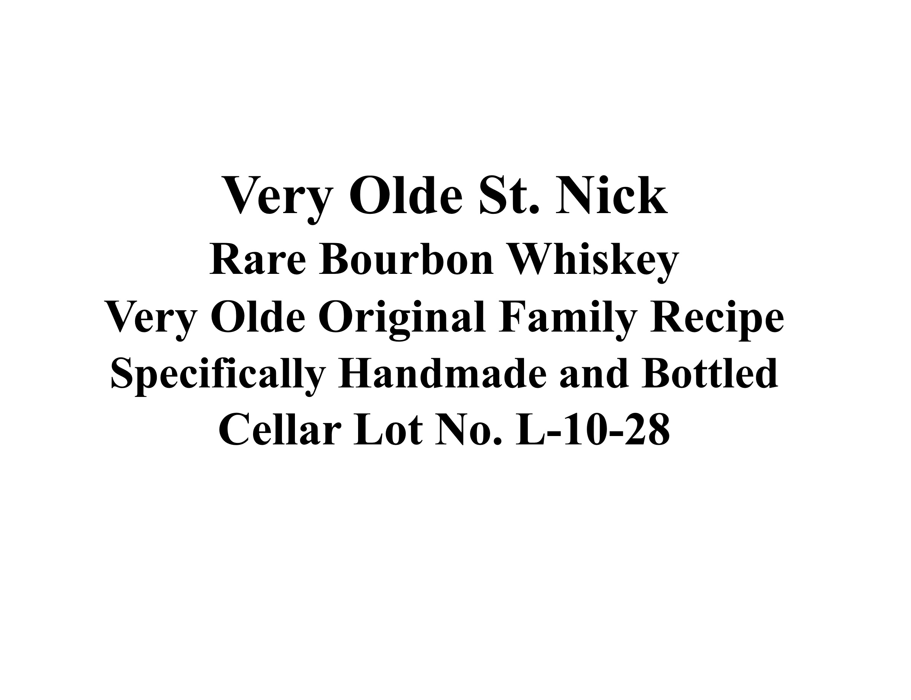
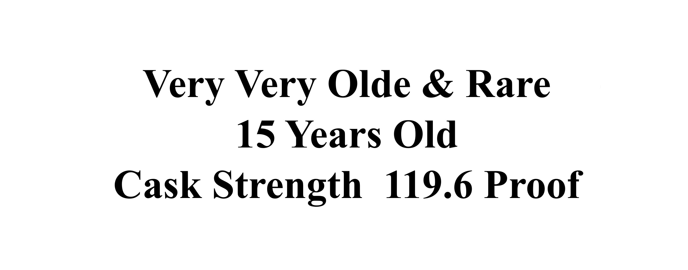
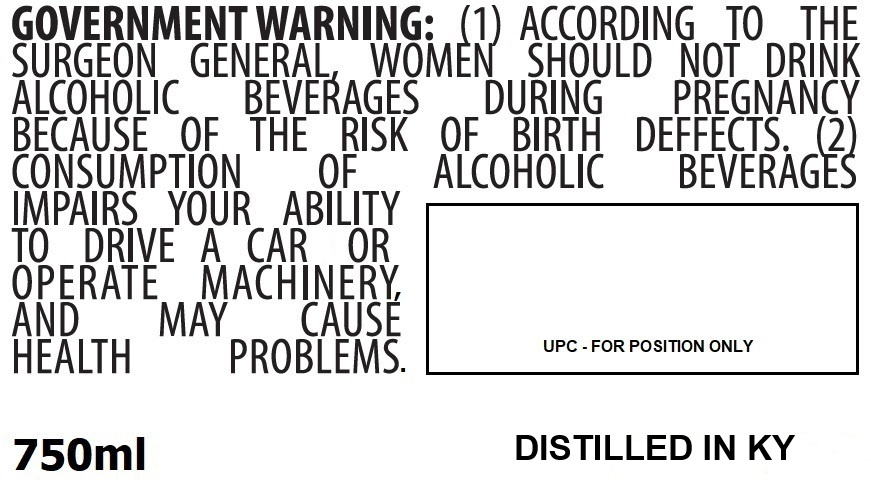

# TTB COLA Label Images - TTBID 25357001000332

**Brand Name:** VERY OLDE ST. NICK

**Issue Date:** 01/08/2026

**Origin Code:** 22

**Product Class/Type:** 141

**Source:** [TTB Public COLA Registry](https://ttbonline.gov/colasonline/viewColaDetails.do?action=publicFormDisplay&ttbid=25357001000332)

## Label Images

### Back Label

### Label 1

### Label 3

### Label 4

## Extracted Label Text

*Text extracted via OCR - may contain errors*

### Back Label

Very Olde St. Nick

Rare Bourbon Whiskey

Very Olde Original Family Recipe

Specifically Handmade and Bottled

Cellar Lot No. L-10-28

59.8% alc./vol.

750ml

VAN WINKLE

The Bespoke Barrels

Bottle 1 of 150

Bottled By:

426 Sutherland Road

Olde St. Nick Distillery

Bardstown, Kentucky USA

### Label 1

Very Olde St. Nick

Rare Bourbon Whiskey

Very Olde Original Family Recipe

Specifically Handmade and Bottled

Cellar Lot No. L-10-28

### Label 3

Very Very Olde & Rare

15 Years Old

Cask Strength 119.6 Proof

### Label 4

GOVERNMENT WARNING: { ACCORDING 10 THE
SURGEON GENERAL, WOMEN SHOULD NOT DRINK
ALCOHOLIC — BEVERAGES DURING — PREGNANCY
BECAUSE OF THE RISK OF BIRTH DEFFECTS. 2)
CONSUMPTION OF ALCOHOLIC BEVERAG
IMPAIRS YOUR_ ABILITY

TO DRIVE A CAR OR

OPERATE MACHINERY,

AND_ MAY _ CAUSE

HEALTH PROBLEMS. UPC - FOR POSITION ONLY
750ml DISTILLED IN KY
