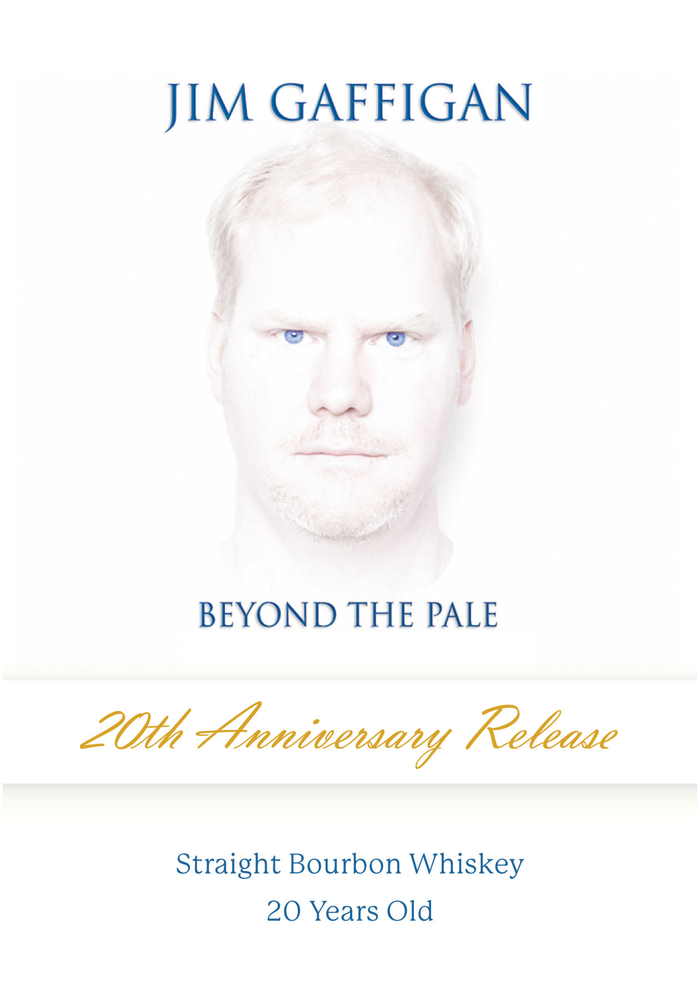
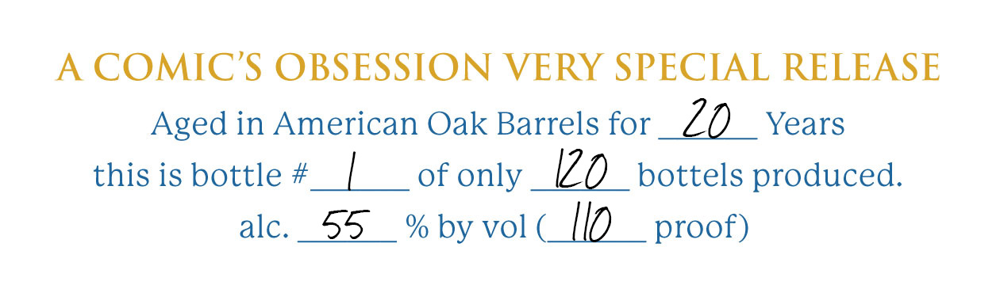
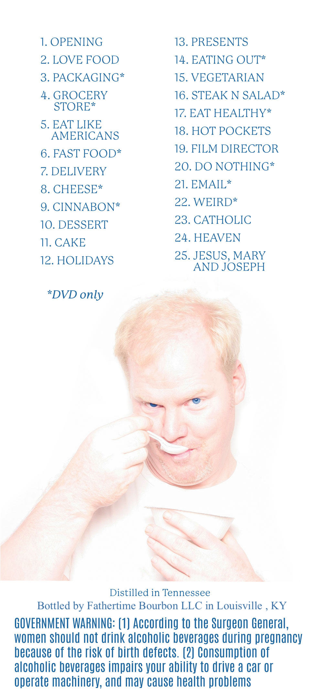

# TTB COLA Label Images - TTBID 25361001000042

**Brand Name:** BEYOND THE PALE

**Issue Date:** 01/05/2026

**Origin Code:** 22

**Product Class/Type:** 101

**Source:** [TTB Public COLA Registry](https://ttbonline.gov/colasonline/viewColaDetails.do?action=publicFormDisplay&ttbid=25361001000042)

## Label Images

### Label 1

### Label 2

### Label 3

## Extracted Label Text

*Text extracted via OCR - may contain errors*

### Label 1

pM Sie GAN

wT re

AS

BEYOND THE PALE

Straight Bourbon Whiskey

20 Years Old

### Label 2

A COMIC’S OBSESSION VERY SPECIAL RELEASE

Aged in American Oak Barrels for ZO Years

this is bottle #_| of only V0 bottels produced.

alc. 55  %byvol(_[I0 _ proof)

### Label 3

1. OPENING

13. PRESENTS

2. LOVE FOOD

14. EATING OUT*

3. PACKAGING*

15. VEGETARIAN

4. GROCERY

16. STEAK N SALAD*

STORE*

17, EAT HEALTHY*

5. EAT LIKE

AMERICANS

18. HOT POCKETS

19. FILM DIRECTOR

6. FAST FOOD*

7. DELIVERY

20. DO NOTHING*

21. EMAIL*

8. CHEESE*

9. CINNABON*

22. WEIRD*

10. DESSERT

23. CATHOLIC

24. HEAVEN

11. CAKE

12. HOLIDAYS

25. JESUS, MARY

AND JOSEPH

*DVD only

Ne

er

a

|

&

Distilled in Tennessee

Bottled by Fathertime Bourbon LLC in Louisville , KY

GOVERNMENT WARNING: (1) According to the Surgeon General,

women should not drink alcoholic beverages during pregnancy

because of the risk of birth defects. (2) Consumption of

alcoholic beverages impairs your ability to drive a car or

Operate machinery, and may cause health problems
