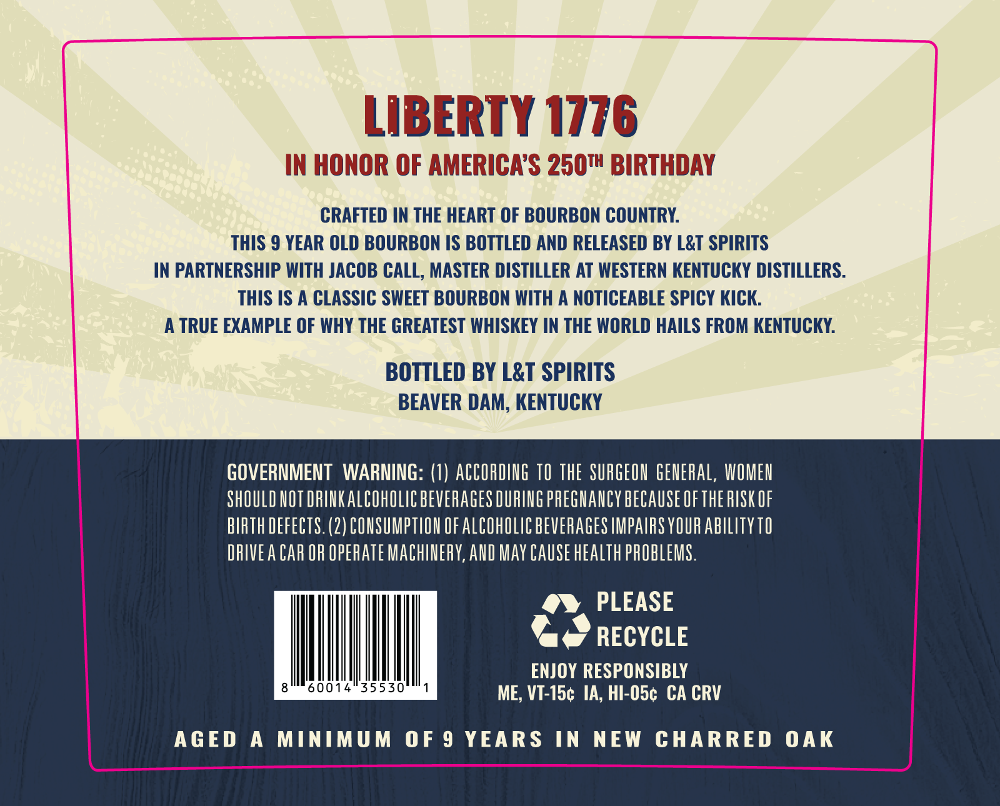
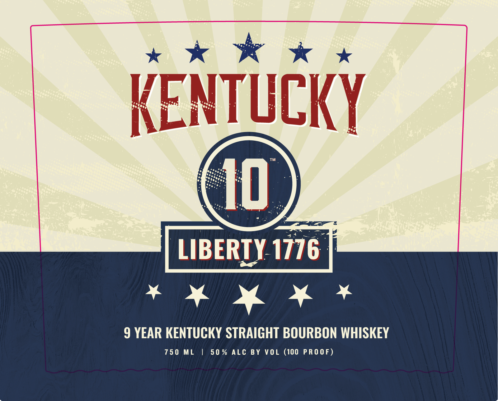

# TTB COLA Label Images - TTBID 25364001000183

**Brand Name:** KENTUCKY 10 LIBERTY 1776

**Issue Date:** 01/02/2026

**Origin Code:** 22

**Product Class/Type:** 101

**Source:** [TTB Public COLA Registry](https://ttbonline.gov/colasonline/viewColaDetails.do?action=publicFormDisplay&ttbid=25364001000183)

## Label Images

### Back Label

### Front Label

## Extracted Label Text

*Text extracted via OCR - may contain errors*

### Back Label

>

Lie

DET

TY 1776

rp

IN HONOR OF AM

ch

ICA’S 250™ BIRTHDAY

CRAFTED IN THE HEART OF BOURBON COUNTRY.

THIS 9 YEAR OLD BOURBON IS BOTTLED AND RELEASED BY L&T SPIRITS

IN PARTNERSHIP WITH JACOB CALL, MASTER DISTILLER AT WESTERN KENTUCKY DISTILLERS.

THIS IS A CLASSIC SWEET BOURBON WITH A NOTICEABLE SPICY KICK

A TRUE EXAMPLE OF WHY THE GREATEST WHISKEY IN THE WORLD HAILS FROM KENTUCKY.

BOTTLED BY L&T SPIRITS

BEAVER DAM, KENTUCKY

GOVERNMENT WARNING: (1) ACCORDING TO THE SURGEON GENERAL, WOMEN

SHOULD NOT DRINK ALCOHOLIC BEVERAGES DURING PREGNANCY BECAUSE OF THE RISK OF

BIRTH DEFECTS. (2) CONSUMPTION OF ALCOHOLIC BEVERAGES IMPAIRS YOUR ABILITY 10

DRIVEA CAR OR OPERATE MACHINERY, AND MAY CAUSE HEALTH PROBLEMS

“fs PLEASE

ae RECYCLE

ENJOY RESPONSIBLY

60014 35530

VT-15¢ IA, HI-O5¢ CA CRV

AGED A MINIMUM OF 9 YEARS IN NEW CHARRED OAK

### Front Label

wk ww

0

LIBERTY 1776

ane) fl ee

9 YEAR KENTUCKY STRAIGHT BOURBON WHISKEY

750 ML | 50% ALC BY VOL (100 PROOF)
