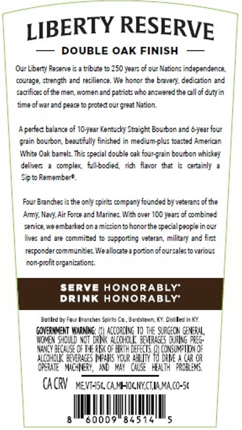
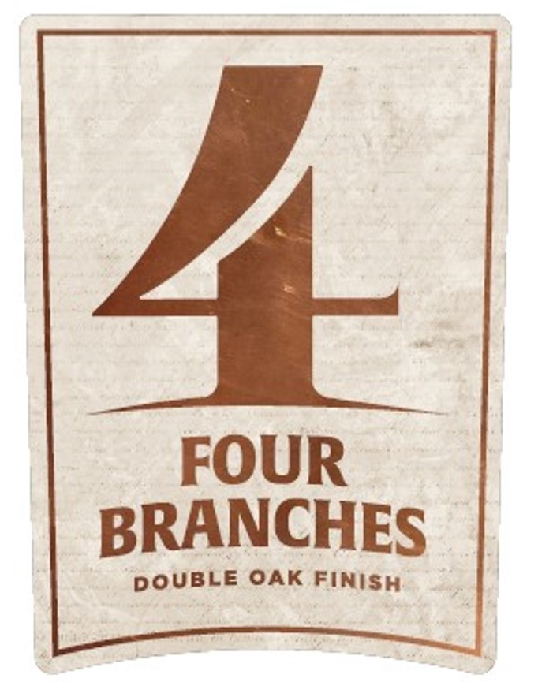
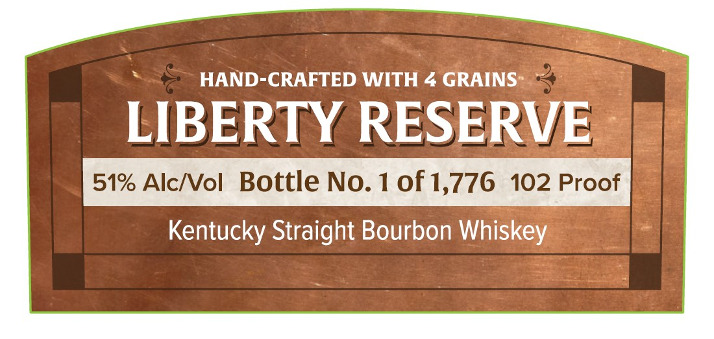
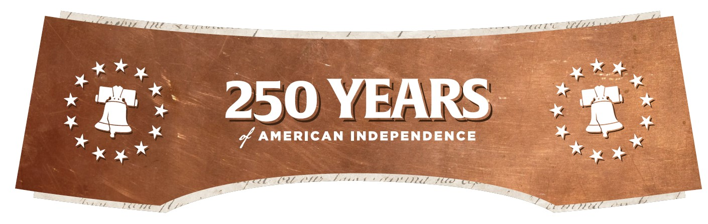
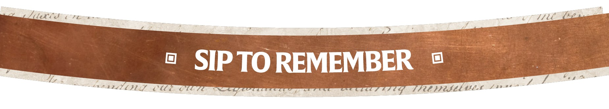

# TTB COLA Label Images - TTBID 25364001000219

**Brand Name:** FOUR BRANCHES

**Issue Date:** 01/21/2026

**Origin Code:** 22

**Product Class/Type:** 101

**Source:** [TTB Public COLA Registry](https://ttbonline.gov/colasonline/viewColaDetails.do?action=publicFormDisplay&ttbid=25364001000219)

## Label Images

### Back Label

### Label 1

### Label 2

### Label 4

### Label 5

## Extracted Label Text

*Text extracted via OCR - may contain errors*

### Back Label

i

~ LIBERTY RESERVE

|

— DOUBLE OAK FINISH —

|

Our Liberty Reserve is a tribute to 250 years of our Nations independence,

|

courage, stength and resilience. We honor the bravery, dedication and

sacrifices of the men, women and patriots who answered the cal of dutyin

time of war and peace to protect our great Nation.

A perfect balance of 10-year Kentucky Straight Bourbon and 6-year four

|

grain bourbon, beautifully finished in medium-plus toasted American |

White Ozk barrels. This special double oak fourgrain bourbon whiskey

delivers a complex, fulkbodied, rich flavor that is certainly a

Sip to Remember®.

|

|

Four Branches is the only spirits company founded by veterans of the

Ammy, Navy, Air Force and Marines. With over 100 years of combined

service, we embarked on a mission to honor the special people in our

fives and are committed to supporting veteran, military and first

responder communities. We allocate 2 portion of oursales to various

|

non-profit organizations.

|

|

Betled by Four Branches Sain

0. Bardstown, KY. Distlled in KY

CORAL,

WOMEN SHOULD NO

aly DING 10 Tt

NANCY BECAUSE

f THE RAK

pat 0

ALCOHOLIC BEVERAG

ARS YOUR AALITY

AGR OR

OPERATE

AND NAY GSE aN PROBLENS,

CACRY ve

54. CA MHOGNY,CTIAMA,(O-5¢

SAMUEL,

0009

84514

### Label 1

FOUR

BRANCHES

DOUBLE OAK FINisy

### Label 2

HAND-CRAFTED WITH 4 GRAINS* —

LIBERTY RESERVE

Kentucky Straight Bourbon Whiskey

### Label 4

2il x

cxeas

Lo

xm y

x mie

250 YEARS”

s

of AMERICAN INDEPENDENCE

«4%

wy ot

Cel CL 7

Mb tt

### Label 5

LHES 0 7 oe

T22L

= SIPTOREMEMBER ©

2

Lr

£

Yes

Aaa Be Cl

a oro,

ate

CE PPOSEL VIL 7 97**
