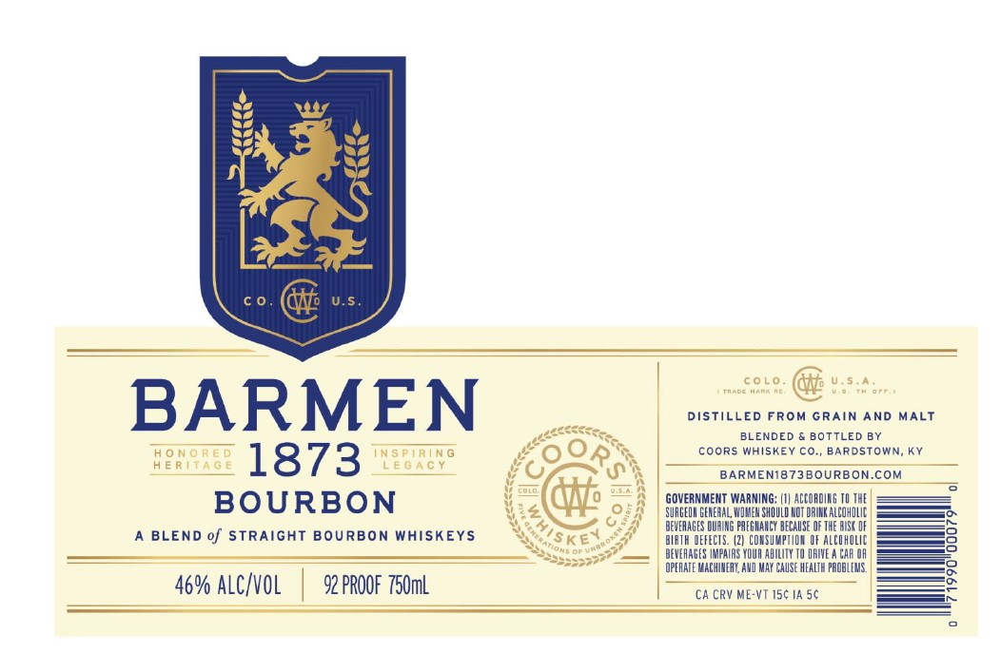
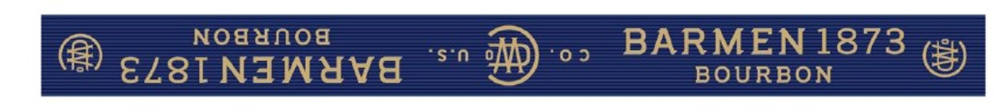

# TTB COLA Label Images - TTBID 25364001000233

**Brand Name:** BARMEN 1873

**Issue Date:** 01/02/2026

**Origin Code:** 22

**Product Class/Type:** 121

**Source:** [TTB Public COLA Registry](https://ttbonline.gov/colasonline/viewColaDetails.do?action=publicFormDisplay&ttbid=25364001000233)

## Label Images

### Front Label

### Label 2

## Extracted Label Text

*Text extracted via OCR - may contain errors*

### Front Label

colo

U.s.4

DISTILLED FROM GRAIN AND MALT

BARMEN

BLENDED & BOTTLED BY

HONORED

INSPIRING

£00

COORS WHISKEY CO., BARDSTOWN, KY

HERITAGE

1873

LEGACY

BARMEN1873B0URBON.COM

fra

Err

GOVERNMENT WARNING: 1) ACCORDING TH THE

BOURBON

4@

CH:

SURGEON GENERAL WOMEN SHOULD NOT ORIKALCOAOLIC

—

BEVERAGES DURING PRESRARCY BECASE OF THE ISK OF

A BLEND of STRAIGHT BOURBON WHISKEYS

We,

Kets:

ALATH DEFECTS. (2) CONSUMPTION OF ALCOMOLIC

Ss

SSS

Smetage

BEVERAGES IMPAIRS YOUR ABILITY TD ORIVEA CAR OR

“335531

CPURATE MACHINERY, AUD MAY CAUSE NEATH PROBLEMS,

—s

CA CRY ME-VT 15¢ 1A 5¢

6% ALC/VOL | 92 PROOF 750mL.

### Label 2

it

ae

D

-—)

ar
