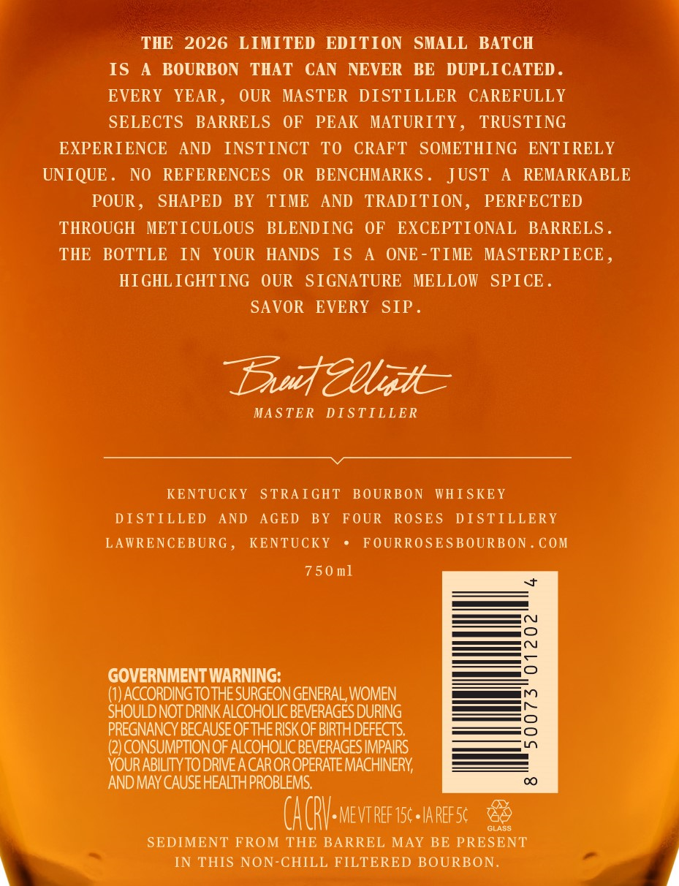
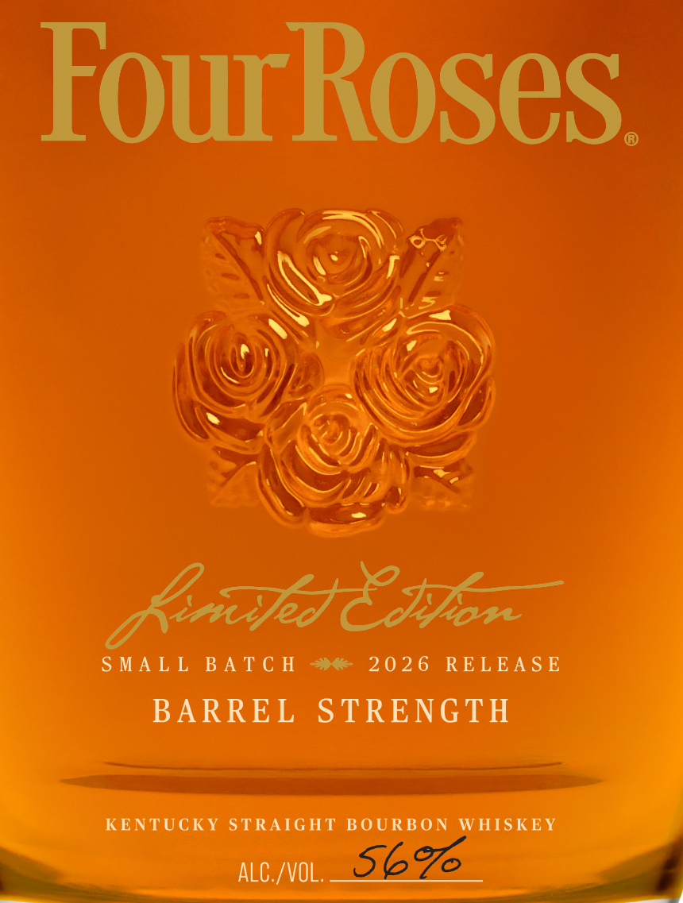

# TTB COLA Label Images - TTBID 25364001000514

**Brand Name:** FOUR ROSES

**Fanciful Name:** LIMITED EDITION SMALL BATCH

**Issue Date:** 01/05/2026

**Origin Code:** 22

**Product Class/Type:** 101

**Source:** [TTB Public COLA Registry](https://ttbonline.gov/colasonline/viewColaDetails.do?action=publicFormDisplay&ttbid=25364001000514)

## Label Images

### Back Label

### Front Label

### Label 3

## Extracted Label Text

*Text extracted via OCR - may contain errors*

*1 image(s) excluded: text did not meet readability threshold*

### Back Label

—

THE 2026 LIMITED EDITION SMALL BATCH

IS A BOURBON THAT CAN NEVER BE DUPLICATED.

EVERY YEAR, OUR MASTER DISTILLER CAREFULLY

SELECTS BARRELS OF PEAK MATURITY, TRUSTING
EXPERIENCE AND INSTINCT TO CRAFT SOMETHING ENTIRELY

UNIQUE. NO REFERENCES OR BENCHMARKS. JUST A REMARKABLE
POUR, SHAPED BY TIME AND TRADITION, PERFECTED

THROUGH METICULOUS BLENDING OF EXCEPTIONAL BARRELS.
THE BOTTLE IN YOUR HANDS IS A ONE-TIME MASTERPIECE,

HIGHLIGHTING OUR SIGNATURE MELLOW SPICE.

SAVOR EVERY SIP.

Dau Mgt

MASTER DISTILLER

KENTUCKY STRAIGHT BOURBON WHISKEY
DISTILLED AND AGED BY FOUR ROSES DISTILLERY
LAWRENCEBURG, KENTUCKY * FOURROSESBOURBON.COM

750ml

GOVERNMENT WARNING:

(1) ACCORDING TO THE SURGEON GENERAL, WOMEN
SHOULD NOT DRINK ALCOHOLIC BEVERAGES DURING
PREGNANCY BECAUSE OF THE RISK OF BIRTH DEFECTS.
(2) CONSUMPTION OF ALCOHOLIC BEVERAGES IMPAIRS
YOUR ABILITY TO DRIVE A CAR OR OPERATE MACHINERY,
AND MAY CAUSE HEALTH PROBLEMS.

(ACRV-mevrner scetanerse &&

SEDIMENT FROM THE BARREL MAY BE PRESENT
IN THIS NON-CHILL FILTERED BOURBON.

### Front Label

ourkoses.

SMALL BATCH »« 2026 RELEASE a

BARREL STRENGTH

pease
