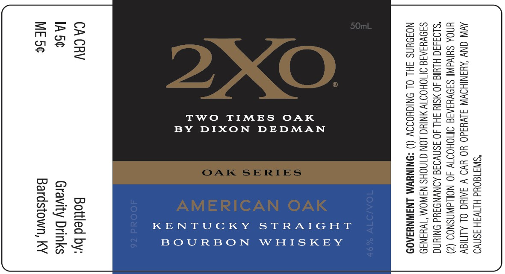

# TTB COLA Label Images - TTBID 25365001000019

**Brand Name:** 2X0

**Issue Date:** 01/12/2026

**Origin Code:** 22

**Product Class/Type:** 101

**Source:** [TTB Public COLA Registry](https://ttbonline.gov/colasonline/viewColaDetails.do?action=publicFormDisplay&ttbid=25365001000019)

## Label Images

### Label 1

## Extracted Label Text

*Text extracted via OCR - may contain errors*

### Label 1

"SWI180Ud HINWSH 3SNVO
AVIN ONY AYANIHOWW SLV¥3d0 YO YVO V SAIC OL ALMIGY
UNOA SHIVAINI SIOVYIAIS IMOHOTW 40 NOLLdWASNOS (2)

*SLO3430 HLYIG 40 MSIY SH 40 ISNVOSE AONVNDAUd ONIN
SJOVYIATS OMOHOTTY NING LON GINOHS NAWOM “TWHaNa9
NOJOUNS JHL OL ONIGHOIOY (1) *ONINYWM LNAWNYSA0D

TWO TIMES OAK
BY DIXON DEDMAN

KENTUCKY STRAIGHT
BOURBON WHISKEY

Bottled by:
Gravity Drinks

ardstown, KY
