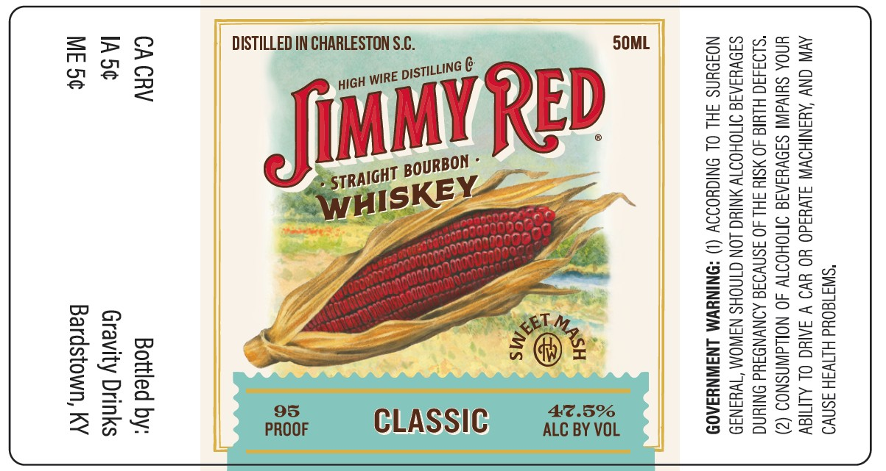

# TTB COLA Label Images - TTBID 25365001000024

**Brand Name:** JIMMY RED

**Issue Date:** 01/12/2026

**Origin Code:** 22

**Product Class/Type:** 101

**Source:** [TTB Public COLA Registry](https://ttbonline.gov/colasonline/viewColaDetails.do?action=publicFormDisplay&ttbid=25365001000024)

## Label Images

### Label 1

## Extracted Label Text

*Text extracted via OCR - may contain errors*

### Label 1

"SWI180Ud HINWSH ASAD
AVIN CNY AYANIHOWW SLV¥3ad0 YO YVO V SAIC OL ALMIGY
UNOA SUIVAINI SIOVYIAIG OMOHOTW 40 NOLLdWNSNOS (2)
“SLO3430 HLUI 40 MSIY SH 40 SSNS AONVNDAUd ONIN
SAOVHIAIS IMOHOTTV MNIUG LON CINOHS NAWOM ‘TWHINI9D
NOJOUNS FHL OL ONIGYOIOY (1) *QNINYWM LNAWNYIA0D

5OML

AZ.5%
ALC BY VOL

CLASSIC

DISTILLED IN CHARLESTON S.C.

CA CRV Bottled by:
IA5¢ Gravity Drinks
ME 5¢ Bardstown, KY
