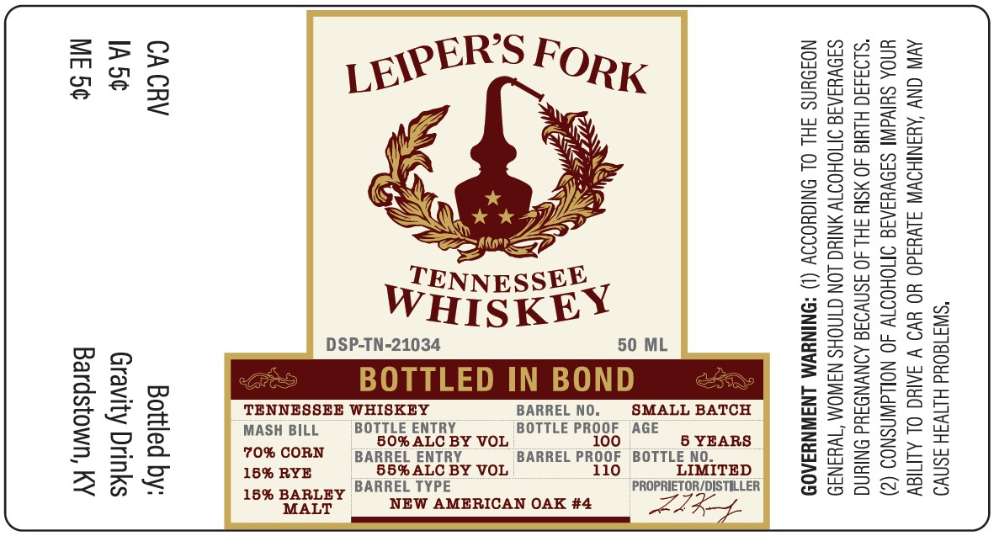

# TTB COLA Label Images - TTBID 25365001000026

**Brand Name:** LEIPER'S FORK

**Issue Date:** 01/09/2026

**Origin Code:** 22

**Product Class/Type:** 140

**Source:** [TTB Public COLA Registry](https://ttbonline.gov/colasonline/viewColaDetails.do?action=publicFormDisplay&ttbid=25365001000026)

## Label Images

### Label 1

## Extracted Label Text

*Text extracted via OCR - may contain errors*

### Label 1

*SWI180Ud HINW3H 3SNVO.
AVIN CNY AYANIHOWW SLV¥3ad0 YO YVO V SAIC OL ALMIGY
UNOA SHIVAINI SIOVYIAIG OMOHOTW 40 NOLdWASNOS (2)
*SLO3430 HLYIG 40 MSIY SH 40 SSNVOSE AONVNDAUd ONIN
S3OVYIAIG OMOHOITW YNIUG LON GINOHS NAWOM “WHANS9
NOJOUNS JHL OL ONIGHOIOY (1) *ONINYWM LNAWNYIA0D

5 YEARS
LIMITED
PROPRIETOR/DISTILLER

eee

SMALL BATCH

BOTTLE PROOF AGE

100
BARREL PROOF BOTTLE NO.
110

BARREL NO.

NEW AMERICAN OAK #4

T. ¥
WHISKEY

88

> >

all
Ek
=
Egegs
Be enaa
Mure
SEREoe
Hoa «
Bo ao 2
a al
S645 35
g28e 43
22 oR aa
ageee
Bee Sj

CA CRV Bottled by:
IA5¢ Gravity Drinks
Bardstown, KY
