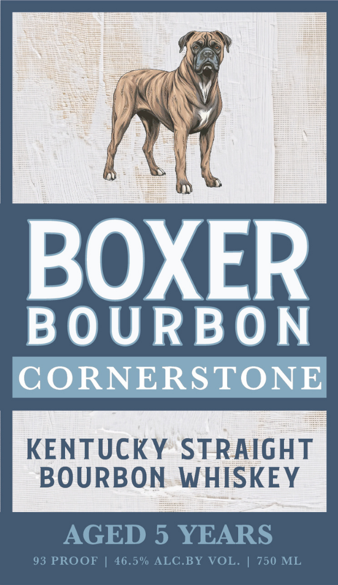
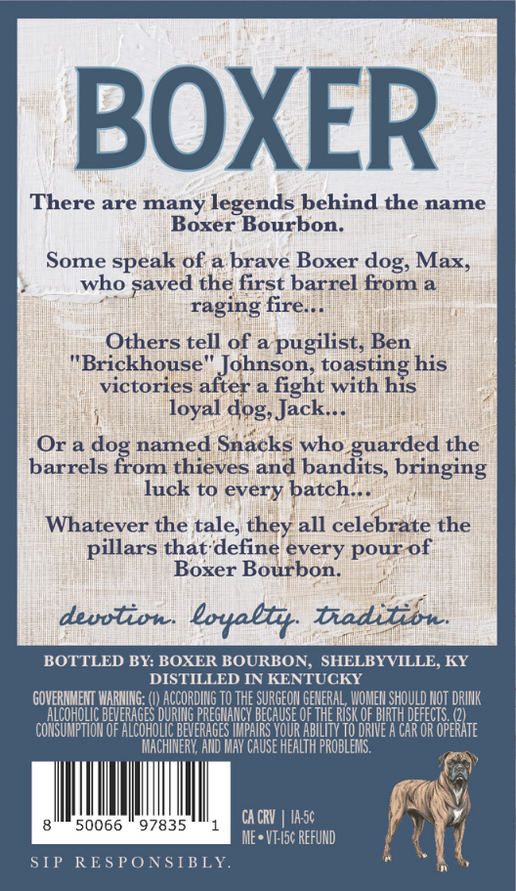

# TTB COLA Label Images - TTBID 25365001000157

**Brand Name:** BOXER

**Issue Date:** 01/12/2026

**Origin Code:** 22

**Product Class/Type:** 101

**Source:** [TTB Public COLA Registry](https://ttbonline.gov/colasonline/viewColaDetails.do?action=publicFormDisplay&ttbid=25365001000157)

## Label Images

### Front Label

### Label 2

## Extracted Label Text

*Text extracted via OCR - may contain errors*

### Front Label

| V

)

Ci

WwW

BOXER

BOURBON

CORNERSTONE

KENTUCKY STRAIGHT

BOURBON WHISKEY

cn

|

|

### Label 2

BOXER

There are many legends behind the name

Boxer Bourbon.

Some speak of a brave Boxer dog, Max,

who paved the first barrel from a

raging fire...

Others tell of a pugilist, Ben

"Brickhouse"

johnson, toasting his

victories after a fight with his

loyal dog, Jack...

Or a dog named Snacks who guarded the

barrels from thieves and bandits, bringing

luck to every bate!

Whatever the tale, they all celebrate the

pillars that-define évery pour-of

Boxer Bourbon.

devotion. loyally

Diadilion.

BOTTLED BY:

R BOURBO!

LB

ILLE,

ILLED IN

TU

Chan alt La IN

GENERAL WOMEN SHOULD 4 DRINK

ES DURING Bat NANCY Hse

OF THE RISK.

(2)

COST DF LR BEG IMPAIRS YOUR ABILITY 10 TRIE AKG OPERATE

MACHINERY, AND MAY CAUSE HEALTH PROBLEMS.

v)

8

50066 © 97835

CACRV | IA-5¢

ME* VE-5¢ REFUND

4

SIP

RESPONSIBLY
