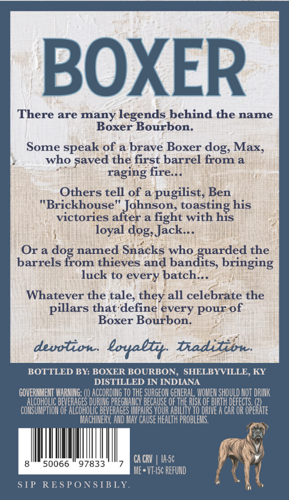
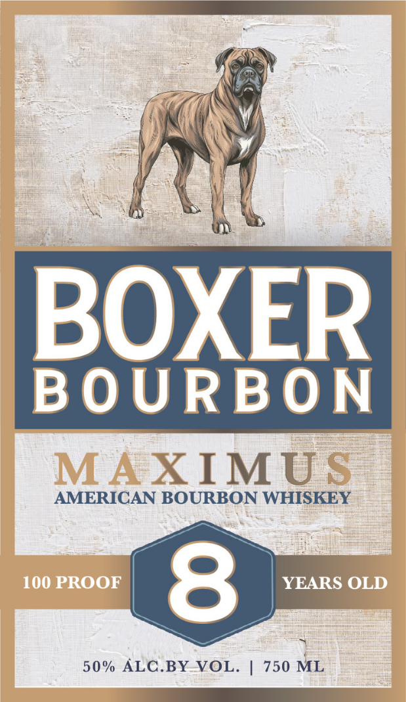

# TTB COLA Label Images - TTBID 25365001000159

**Brand Name:** BOXER

**Issue Date:** 01/05/2026

**Origin Code:** 22

**Product Class/Type:** 141

**Source:** [TTB Public COLA Registry](https://ttbonline.gov/colasonline/viewColaDetails.do?action=publicFormDisplay&ttbid=25365001000159)

## Label Images

### Back Label

### Front Label

## Extracted Label Text

*Text extracted via OCR - may contain errors*

### Back Label

BOXER

There are many legends behind the name

Boxer Bourbon.

Some speak of a brave Boxer dog, Max,

who saved the first barrel from a

raging fire...

Others tell of a pugilist, Ben

"Brickhouse" Jdhnson, toasting his

victories after a fight with his

loyal dog, Jack...

Or ado

named Sna¢ks who

arded the

barrels from thieves and bandits, bringing

luck to every batch...

Whatever the tale, they all celebrate the

pillars that‘define ¢very pourof

Boxer Bourbon.

BOTTLED BY.

BOXER BOURBON, SHELBYVILLE, KY

DISTILLED IN INDIANA

GOVERNMENT WARNING: (!) ACCORDING TO THE SURGEON GENERAL WOMEN SHOULD NOT DRINK

OHOLI

VERAGES DURING PREGIANCY BECAUSE OF THE RISK OF BIRTH DEFECTS. (2)

CONSUMPTION OF ALCOHOLIC BEVERAGES IMPAIRS YOUR ABILITY TO DRIVE A CAR OR OPERATE

MACHINERY, AND MAY CAUSE HEALTH PROBLEMS.

i

8

50066 © 97833

-

CACRV | 1A-5¢

y

ME-*VF-I5¢ REFUND

¥

SIP

RESP

SIBLY

»

{

### Front Label

A)

)

a

BOX

ER

BOURBON

AMERICAN BOURBON WHISKEY

X IMU

50% ALC.BY-VOL. | 750 ML

SS lll
