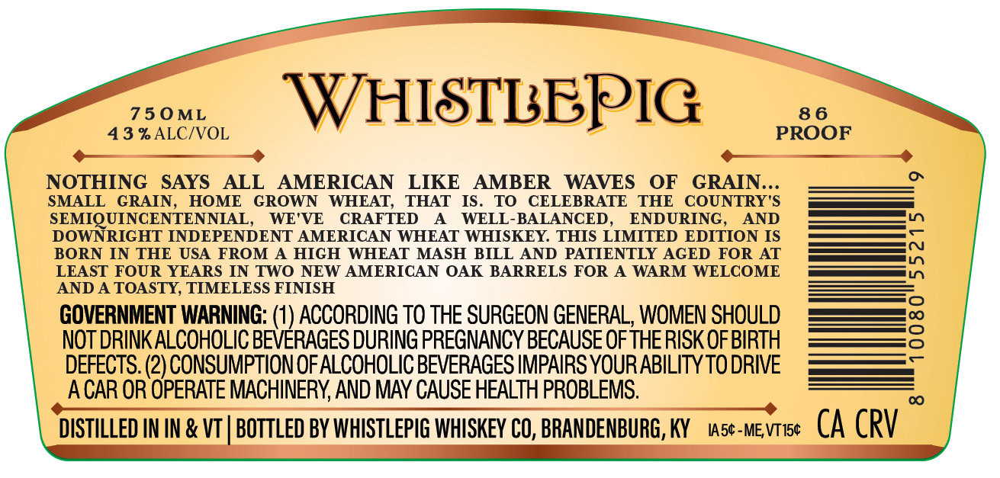
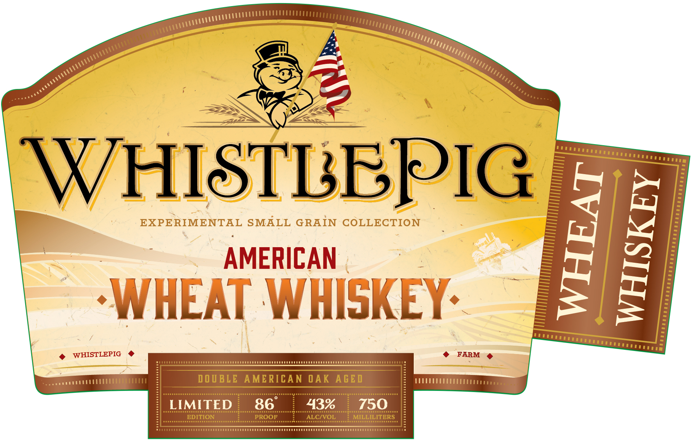
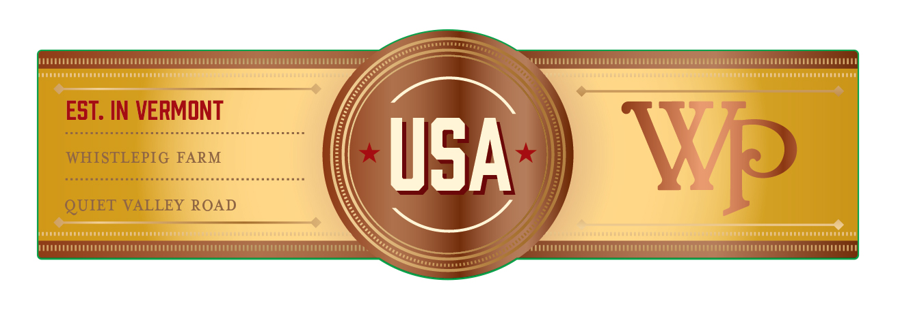

# TTB COLA Label Images - TTBID 25365001000160

**Brand Name:** WHISTLEPIG

**Issue Date:** 01/05/2026

**Origin Code:** 22

**Product Class/Type:** 140

**Source:** [TTB Public COLA Registry](https://ttbonline.gov/colasonline/viewColaDetails.do?action=publicFormDisplay&ttbid=25365001000160)

## Label Images

### Back Label

### Label 1

### Label 2

## Extracted Label Text

*Text extracted via OCR - may contain errors*

### Back Label

750ML

WH ISTLEPIG

86

43 -_

OOF

—

NOTHING SAYS i. AMERICAN LIKE AMBER WAVES

SMALL GRAIN, HOME GROWN WHEAT, THAT IS.

TO CELEBRATE THE COUNTRY'S

OF caAiNe

SEMIQUINCENTENNIAL, WE'VE CRAFTED A WELL-BALANCED, ENDURING.

AND

——

DOWNRIGHT INDEPENDENT AMERICAN WHEAT WHISKEY. THIS LIMITED EDITION IS

————

——c

BORN IN THE USA FROM A HIGH WHEAT MASH BILL AND PATIENTLY AGED FOR AT

LEAST FOUR YEARS IN TWO NEW AMERICAN OAK BARRELS FOR A WARM WELCOME

——s i)

—s 17)

AND A TOASTY, TIMELESS FINISH

GOVERNMENT WARNING: (1) ACCORDING TO THE SURGEON GENERAL, WOMEN SHOULD

ol

NOT DRINK ALCOHOLIC BEVERAGES DURING PREGNANCY BECAUSE OF THE RISK OF BIRTH

DEFECTS. (2) CONSUMPTION OF ALCOHOLIC BEVERAGES IMPAIRS YOUR ABILITY TO DRIVE

——_—-

ACAR OR OPERATE MACHINERY, AND MAY CAUSE HEALTH PROBLEMS.

DISTILLED IN IN & VT | BOTTLED BY WHISTLEPIG WHISKEY CO, BRANDENBURG, KY stevie (CA CRV

### Label 1

AAU CUCLLCCCLELEE on

vt

{yuu nt ETT

wy

Al

co

r ~

S>

1, My,

“si

SS

ieee

\

aN

we

STUrttaae yy

Go

HI

L

-

PI

EXPERIMENTAL SMALL GRAIN COLLECTION

=

AMERICAN |

as

7

7

= Bo

Z|

Wy

»

Vil

yy

|

‘a

'

Al

wJ

\.

i*.

Vi

i \ j

7

2

rn

SAL rer

@ WHISTLEPIG @

© FARM @

=

DOUBLE AMERICAN OAK AGED

wT

TEEPE tia

### Label 2

LOUUOLUUUUUEELUO EEE ET OU EE EAA TEE EEE

MELLEL cece Cece Coo ocCc cc koEoo

tins

EST, IN VERMONT

i

USA

QUIET WALLEY ROAD

(TD

IMME ELI

canna
