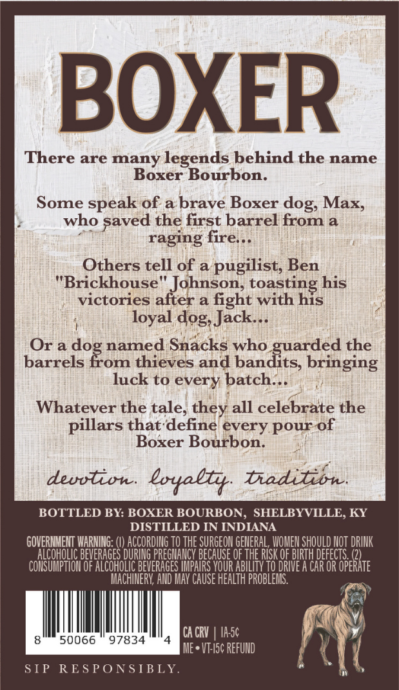
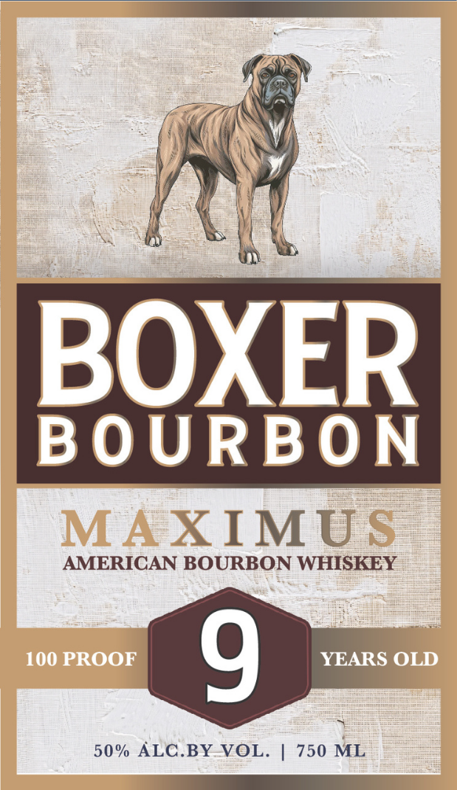

# TTB COLA Label Images - TTBID 25365001000161

**Brand Name:** BOXER

**Issue Date:** 01/05/2026

**Origin Code:** 22

**Product Class/Type:** 141

**Source:** [TTB Public COLA Registry](https://ttbonline.gov/colasonline/viewColaDetails.do?action=publicFormDisplay&ttbid=25365001000161)

## Label Images

### Back Label

### Front Label

## Extracted Label Text

*Text extracted via OCR - may contain errors*

### Back Label

BOXER

There are many legends behind the name

Boxer Bourbon.

Some speak of a: brave Boxer dog, Max,

who saved the first barrel froma

raging fire...

Others tell of a pugilist, Ben

"Brickhouse" Johnson, toasting his

victories after a fight with his

loyal dog, Jack...

Orado

named Snacks who

uarded the

barrels

om thieves and bandits, bringing

luck to every, batch...

Whatever the tale, they all celebrate the

pillars that‘define every pour:

Boxer Bourbon.

devvtion. loyally. Ciadition

BOTTLED BY: BOXER BOURBON, SHELBYVILLE, KY

DISTILLED IN INDIANA

GOVERNMENT WARNING: (|) ACCORDING 10 THE SURGEON GENERAL WOMEN SHOULD NOT DRINK

il

JEVERAGES DURING Hit a OF THE RISK OF BIRTH DEFECTS. (2)

CONSUMPTION OF ALCOHOLIC BEVERAGES IMPAIRS YOUR ABILITY TO DRIVE A CAR OR OPERATE

h

MACHINERY, AND MAY CAUSE HEALTH PROBLEMS.

VI}

8

50066 97834

4

CACRY | IASC

ME*VIEIS¢ REFUND

q

SIP

RESPONSIBLY

on)

(

### Front Label

a

\\

A

:

BOURBON

AMERICAN BOURBON WHISKEY

50% ALC.BY-VOL. | 750 et

—S— lll
