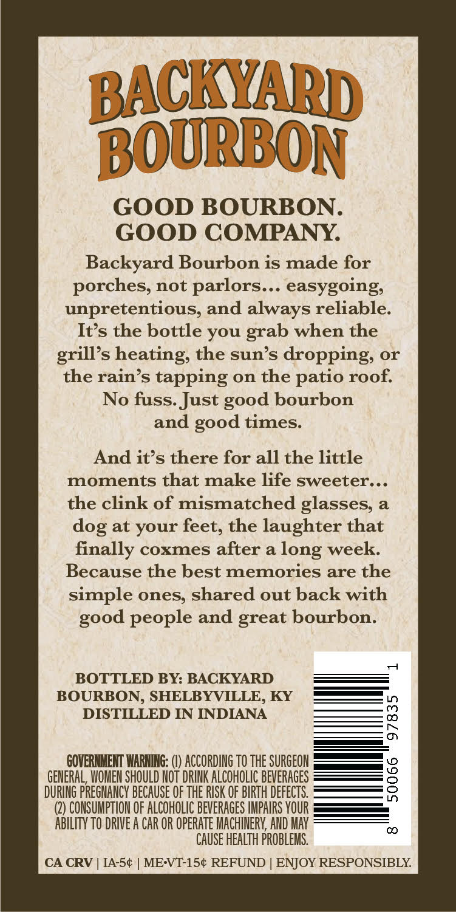
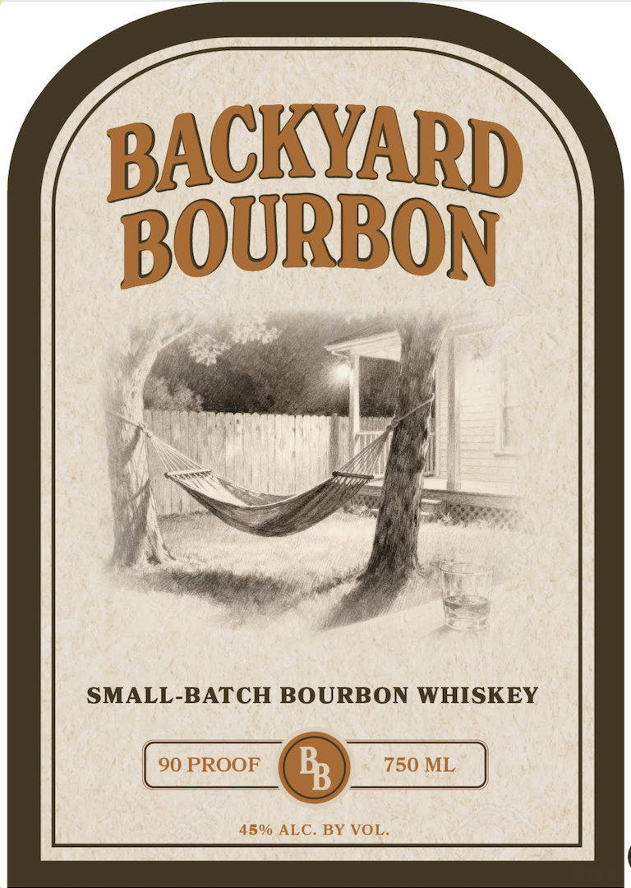

# TTB COLA Label Images - TTBID 25365001000338

**Brand Name:** BACKYARD BOURBON

**Issue Date:** 01/12/2026

**Origin Code:** 22

**Product Class/Type:** 141

**Source:** [TTB Public COLA Registry](https://ttbonline.gov/colasonline/viewColaDetails.do?action=publicFormDisplay&ttbid=25365001000338)

## Label Images

### Back Label

### Label 1

## Extracted Label Text

*Text extracted via OCR - may contain errors*

*1 image(s) excluded: text did not meet readability threshold*

### Back Label

CKYARN

BOURBON

GOOD BOURBON

GOOD COMPANY.

Backyard Bourbon is made for

porches, not parlors... easygoing,

unpretentious, and always reliable

It’s the bottle you grab when the

grill’s heating, the sun’s dropping, or

the rain’s tapping on the patio roof.

No fuss. Just good bourbon

and good times

And it’s there for all the little

moments that make life sweeter...

the clink of mismatched glasses,

dog at your feet, the laughter that

finally coxmes after a long week.

Because the best memories are the

simple ones, shared out back with

good people and great bourbon

od

BOTTLED BY: BACKYARD

BOURBON, SHELBYVILLE, KY —.

DISTILLED IN INDIANA

RNMENT WARNING: (I) ACCORDING TO THE SURGEON on <2

GENERAL, WOMEN SHOULD NOT DRINK ALCOHOLIC BEVERAGES

DURING PREGHANCY BECAUSE OF THE RISK OF BIRTH DEFECTS.

(2) CONSUMPTION OF ALCOHOLIC BEVERAGES IAS OO =

ABILITY TO DRIVE A CAR OR OPERATE MACHINERY, AND MAY

CAUSE HEALTH PROBLEMS.

oO

CA CRV | IA-5¢ | ME:VT-15¢ REFUND | ENJOY RESPONSIBLY.
